# Admin UI and Example UI

- [Admin UI](#admin-ui)
- [Admin UI Example](#admin-ui-example)

## Admin UI

เนื่องจากโปรแกรมสามารถเปิดให้โค้ดได้หลาย Framework โดยการ `@push('package-scripts')` และ `@push('package-style')` จากหัวข้อ <a href="javascript-css-framework">Javascript CSS Framework </a> ส่วน Apps ที่ Generate ขึ้นมาใหม่ โปรแกรมได้ติดตั้ง CSS Bootstrap Framework ไว้ให้แล้ว ส่วน JS นั้นจะต้อง Incloud เข้ามาเอง

Ref. https://getbootstrap.com/

### Containers

Containers are the most basic layout element in Bootstrap and are required when using our default grid system. Choose from a responsive, fixed-width container (meaning its max-width changes at each breakpoint) or fluid-width (meaning it’s 100% wide all the time).

While containers can be nested, most layouts do not require a nested container.

Container

```html
<div class="container">
  <!-- Content here -->
</div>
```

Container Fluid

Use .container-fluid for a full width container, spanning the entire width of the viewport.

```html
<div class="container-fluid">
  <!-- Content here -->
</div>
```

### Container and Grid Layout

Create a fully responsive, fluid and nestable grid layout.  
การใช้ Container โดยกำหนดขนาดความกว้างสูงสุดเท่ากับ 1140px เพื่อเหมาะสมกับ Resolution 1366px ภายในประกอบด้วย Grid ดังนี้

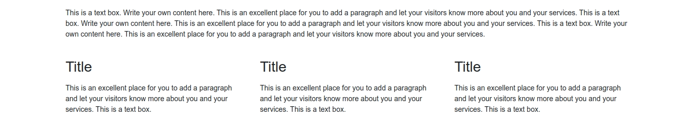

```html
<div class="container">
  <div class="row">
    <div class="col-md-12">
      <h2>Title</h2>
      <p>
        This is a text box. Write your own content here. This is an excellent
        place for you to add a paragraph and let your visitors know more about
        you and your services. This is a text box. Write your own content here.
        This is an excellent place for you to add a paragraph and let your
        visitors know more about you and your services.
      </p>
    </div>
  </div>
  <br />
  <div class="row">
    <div class="col-md-4">
      <h3>Title</h3>
      <p>
        This is an excellent place for you to add a paragraph and let your
        visitors know more about you and your services.
      </p>
    </div>
    <div class="col-md-4">
      <h3>Title</h3>
      <p>
        This is an excellent place for you to add a paragraph and let your
        visitors know more about you and your services.
      </p>
    </div>
    <div class="col-md-4">
      <h3>Title</h3>
      <p>
        This is an excellent place for you to add a paragraph and let your
        visitors know more about you and your services.
      </p>
    </div>
  </div>
</div>
```

### Container Fluid and Grid

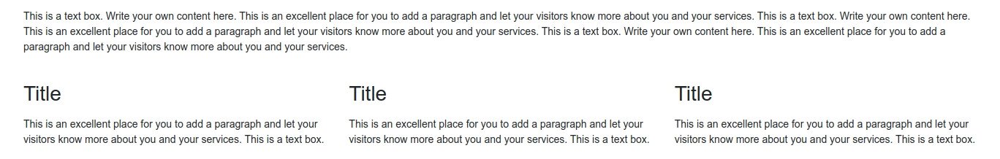

```html
<div class="container-fluid">
  <div class="row">
    <div class="col-md-12">
      <h2>Title</h2>
      <p>
        This is a text box. Write your own content here. This is an excellent
        place for you to add a paragraph and let your visitors know more about
        you and your services. This is a text box. Write your own content here.
        This is an excellent place for you to add a paragraph and let your
        visitors know more about you and your services. This is a text box.
        Write your own content here. This is an excellent place for you to add a
        paragraph and let your visitors know more about you and your services.
      </p>
    </div>
  </div>
  <br />
  <div class="row">
    <div class="col-md-4">
      <h3>Title</h3>
      <p>
        This is an excellent place for you to add a paragraph and let your
        visitors know more about you and your services. This is a text box.
      </p>
    </div>
    <div class="col-md-4">
      <h3>Title</h3>
      <p>
        This is an excellent place for you to add a paragraph and let your
        visitors know more about you and your services. This is a text box.
      </p>
    </div>
    <div class="col-md-4">
      <h3>Title</h3>
      <p>
        This is an excellent place for you to add a paragraph and let your
        visitors know more about you and your services. This is a text box.
      </p>
    </div>
  </div>
</div>
```

### Box Panel

แบบที่ 1

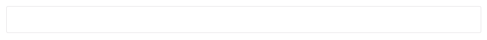

```html
<div class="row">
  <div class="col-md-12">
    <div class="card">
      <div class="card-body">
        Write your own content here.
      </div>
    </div>
  </div>
</div>
```

แบบที่ 2

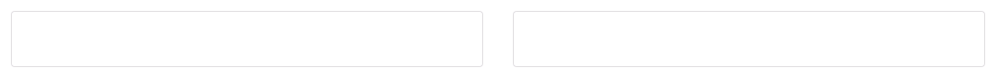

```html
<div class="row">
  <div class="col-md-6">
    <div class="card">
      <div class="card-body">
        Write your own content here.
      </div>
    </div>
  </div>
  <div class="col-md-6">
    <div class="card">
      <div class="card-body">
        Write your own content here.
      </div>
    </div>
  </div>
</div>
```

แบบที่ 3

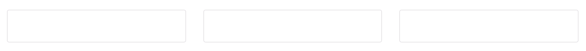

```html
<div class="row">
  <div class="col-md-4">
    <div class="card">
      <div class="card-body">
        Write your own content here.
      </div>
    </div>
  </div>
  <div class="col-md-4">
    <div class="card">
      <div class="card-body">
        Write your own content here.
      </div>
    </div>
  </div>
  <div class="col-md-4">
    <div class="card">
      <div class="card-body">
        Write your own content here.
      </div>
    </div>
  </div>
</div>
```

แบบที่ 4

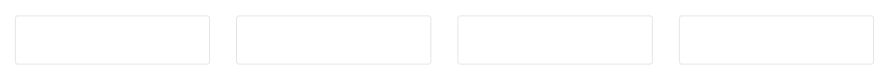

```html
<div class="row">
  <div class="col-md-3">
    <div class="card">
      <div class="card-body">
        Write your own content here.
      </div>
    </div>
  </div>
  <div class="col-md-3">
    <div class="card">
      <div class="card-body">
        Write your own content here.
      </div>
    </div>
  </div>
  <div class="col-md-3">
    <div class="card">
      <div class="card-body">
        Write your own content here.
      </div>
    </div>
  </div>
  <div class="col-md-3">
    <div class="card">
      <div class="card-body">
        Write your own content here.
      </div>
    </div>
  </div>
</div>
```

แบบที่ 5

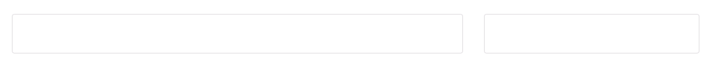

```html
<div class="row">
  <div class="col-md-8">
    <div class="card">
      <div class="card-body">
        Write your own content here.
      </div>
    </div>
  </div>
  <div class="col-md-4">
    <div class="card">
      <div class="card-body">
        Write your own content here.
      </div>
    </div>
  </div>
</div>
```

แบบที่ 6

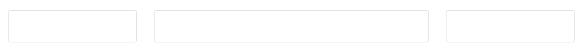

```html
<div class="row">
  <div class="col-md-3">
    <div class="card">
      <div class="card-body">
        Write your own content here.
      </div>
    </div>
  </div>
  <div class="col-md-6">
    <div class="card">
      <div class="card-body">
        Write your own content here.
      </div>
    </div>
  </div>
  <div class="col-md-3">
    <div class="card">
      <div class="card-body">
        Write your own content here.
      </div>
    </div>
  </div>
</div>
```

### Card Panel

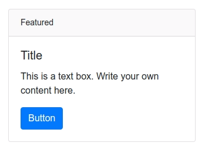

```html
<div class="row">
  <div class="col-md-4">
    <div class="card">
      <div class="card-header">
        Featured
      </div>
      <div class="card-body">
        <h5 class="card-title">Title</h5>
        <p class="card-text">
          This is a text box. Write your own content here.
        </p>
        <a href="#" class="btn btn-primary">Button</a>
      </div>
    </div>
  </div>
</div>
```

### table

Table

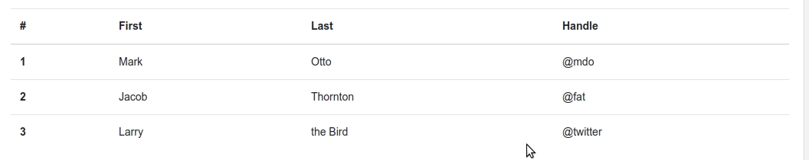

```html
<table class="table">
  <thead>
    <tr>
      <th scope="col">#</th>
      <th scope="col">Heading</th>
      <th scope="col">Heading</th>
      <th scope="col">Heading</th>
    </tr>
  </thead>
  <tbody>
    <tr>
      <th scope="row">1</th>
      <td>Data</td>
      <td>Data</td>
      <td>Data</td>
    </tr>
    <tr>
      <th scope="row">2</th>
      <td>Data</td>
      <td>Data</td>
      <td>Data</td>
    </tr>
    <tr>
      <th scope="row">3</th>
      <td>Data</td>
      <td>Data</td>
      <td>Data</td>
    </tr>
  </tbody>
</table>
```

### Button

Button Group

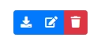

```html
<div class="btn-group btn-group-sm" role="group">
  <a href="javascript:void(0)" class="btn btn-primary">
    <i class="fa fa-download" title="Download"></i>
  </a>
  <a href="javascript:void(0)" class="btn btn-primary">
    <i class="fa fa-edit" title="Edit"></i>
  </a>
  <a href="javascript:void(0)" class="btn btn-danger">
    <i class="fa fa-trash" title="Delete"></i>
  </a>
</div>
```

Buttons

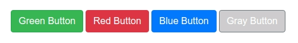

```html
<p>
  <a href="javascript:void(0)" class="btn btn-success">Green Button</a>
  <a href="javascript:void(0)" class="btn btn-danger">Red Button</a>
  <a href="javascript:void(0)" class="btn btn-primary">Blue Button</a>
  <a href="javascript:void(0)" class="btn btn-secondary">Gray Button </a>
</p>
```

### Form

Form

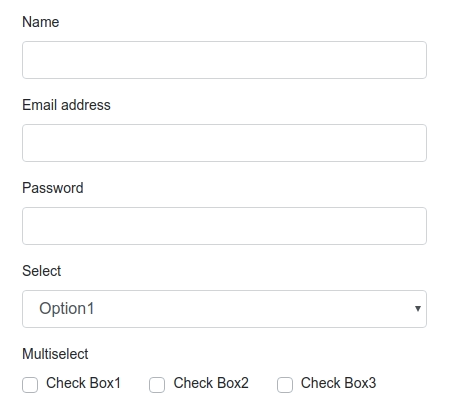

```html
<div class="col-md-4">
  <form>
    <div class="form-group">
      <label for="Name">Name</label>
      <input
        type="text"
        class="form-control"
        id="Name"
        aria-describedby="emailHelp"
      />
    </div>
    <div class="form-group">
      <label for="exampleInputEmail1">Email address</label>
      <input
        type="email"
        class="form-control"
        id="exampleInputEmail1"
        aria-describedby="emailHelp"
      />
    </div>
    <div class="form-group">
      <label for="exampleInputPassword1">Password</label>
      <input type="password" class="form-control" id="exampleInputPassword1" />
    </div>
    <div class="form-group">
      <label>Select</label>
      <select class="form-control">
        <option>Option1</option>
        <option>Option2</option>
        <option>Option3</option>
      </select>
    </div>
    <div class="form-group">
      <div>
        <label for="exampleInputPassword1">Multiselect</label>
      </div>
      <div>
        <span class="px-md-4 custom-checkbox">
          <input
            type="checkbox"
            class="custom-control-input"
            id="customCheck1"
          />
          <label class="custom-control-label" for="customCheck1"
            >Check Box1</label
          >
        </span>
        <span class="px-md-4 custom-checkbox">
          <input
            type="checkbox"
            class="custom-control-input"
            id="customCheck2"
          />
          <label class="custom-control-label" for="customCheck2"
            >Check Box2</label
          >
        </span>
        <span class="px-md-4 custom-checkbox">
          <input
            type="checkbox"
            class="custom-control-input"
            id="customCheck3"
          />
          <label class="custom-control-label" for="customCheck3"
            >Check Box3</label
          >
        </span>
      </div>
    </div>
    <button type="submit" class="btn btn-primary">Submit</button>
  </form>
</div>
```

Form Inline Label

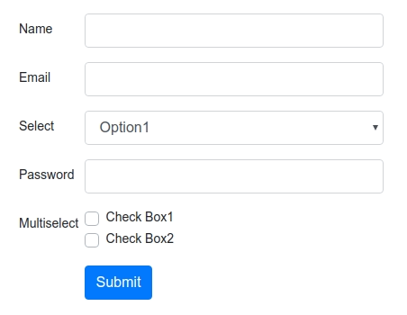

```html
<div class="col-md-4">
  <form>
    <div class="form-group row">
      <label for="staticName" class="col-sm-2 col-form-label">Name</label>
      <div class="col-sm-10">
        <input type="text" class="form-control" id="staticName" />
      </div>
    </div>
    <div class="form-group row">
      <label for="staticEmail" class="col-sm-2 col-form-label">Email</label>
      <div class="col-sm-10">
        <input type="email" class="form-control" id="staticEmail" value="" />
      </div>
    </div>
    <div class="form-group row">
      <label for="staticSelect" class="col-sm-2 col-form-label">Select</label>
      <div class="col-sm-10">
        <select class="form-control">
          <option>Option1</option>
          <option>Option2</option>
          <option>Option3</option>
        </select>
      </div>
    </div>
    <div class="form-group row">
      <label for="inputPassword" class="col-sm-2 col-form-label"
        >Password</label
      >
      <div class="col-sm-10">
        <input type="password" class="form-control" id="inputPassword" />
      </div>
    </div>
    <div class="form-group row">
      <label for="inputPassword" class="col-sm-2 col-form-label"
        >Multiselect</label
      >
      <div class="col-sm-10">
        <div class="custom-control custom-checkbox">
          <input
            type="checkbox"
            class="custom-control-input"
            id="customCheck1"
          />
          <label class="custom-control-label" for="customCheck1"
            >Check Box1</label
          >
        </div>
        <div class="custom-control custom-checkbox">
          <input
            type="checkbox"
            class="custom-control-input"
            id="customCheck2"
          />
          <label class="custom-control-label" for="customCheck2"
            >Check Box2</label
          >
        </div>
      </div>
    </div>
    <div class="form-group row">
      <label for="inputPassword" class="col-sm-2 col-form-label"></label>
      <div class="col-sm-10">
        <button type="submit" class="btn btn-primary">Submit</button>
      </div>
    </div>
  </form>
</div>
```

### Tab

<h2>Tab Horizontal</h2>

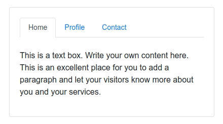

```html
<div class="row">
  <div class="col-md-4">
    <div class="card">
      <div class="card-body">
        <ul class="nav nav-tabs" id="myTab" role="tablist">
          <li class="nav-item">
            <a
              class="nav-link active"
              id="home-tab"
              data-toggle="tab"
              href="#home"
              role="tab"
              aria-controls="home"
              aria-selected="true"
              >Home</a
            >
          </li>
          <li class="nav-item">
            <a
              class="nav-link"
              id="profile-tab"
              data-toggle="tab"
              href="#profile"
              role="tab"
              aria-controls="profile"
              aria-selected="false"
              >Profile</a
            >
          </li>
          <li class="nav-item">
            <a
              class="nav-link"
              id="contact-tab"
              data-toggle="tab"
              href="#contact"
              role="tab"
              aria-controls="contact"
              aria-selected="false"
              >Contact</a
            >
          </li>
        </ul>
        <div class="tab-content" id="myTabContent">
          <div
            class="tab-pane fade show active"
            id="home"
            role="tabpanel"
            aria-labelledby="home-tab"
          >
            <p><br />1. Write your own content here.</p>
          </div>
          <div
            class="tab-pane fade"
            id="profile"
            role="tabpanel"
            aria-labelledby="profile-tab"
          >
            <p><br />2. Write your own content here.</p>
          </div>
          <div
            class="tab-pane fade"
            id="contact"
            role="tabpanel"
            aria-labelledby="contact-tab"
          >
            <p><br />3. Write your own content here.</p>
          </div>
        </div>
      </div>
    </div>
  </div>
</div>
```

<h2>Tab Vertical</h2>

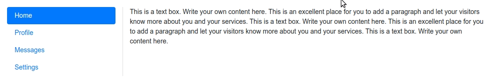

```html
<div class="row">
  <div class="col-3">
    <div
      class="nav flex-column nav-pills"
      id="v-pills-tab"
      aria-orientation="vertical"
    >
      <a
        class="nav-link active"
        id="v-pills-home-tab"
        data-toggle="pill"
        href="#v-pills-home"
        role="tab"
        aria-controls="v-pills-home"
        aria-selected="true"
        >Home</a
      >
      <a
        class="nav-link"
        id="v-pills-profile-tab"
        data-toggle="pill"
        href="#v-pills-profile"
        role="tab"
        aria-controls="v-pills-profile"
        aria-selected="false"
        >Profile</a
      >
      <a
        class="nav-link"
        id="v-pills-messages-tab"
        data-toggle="pill"
        href="#v-pills-messages"
        role="tab"
        aria-controls="v-pills-messages"
        aria-selected="false"
        >Messages</a
      >
      <a
        class="nav-link"
        id="v-pills-settings-tab"
        data-toggle="pill"
        href="#v-pills-settings"
        role="tab"
        aria-controls="v-pills-settings"
        aria-selected="false"
        >Settings</a
      >
    </div>
  </div>
  <div class="col-9">
    <div class="tab-content" id="v-pills-tabContent">
      <div
        class="tab-pane fade show active"
        id="v-pills-home"
        role="tabpanel"
        aria-labelledby="v-pills-home-tab"
      >
        1. Write your own content here.
      </div>
      <div
        class="tab-pane fade"
        id="v-pills-profile"
        role="tabpanel"
        aria-labelledby="v-pills-profile-tab"
      >
        1. Write your own content here.
      </div>
      <div
        class="tab-pane fade"
        id="v-pills-messages"
        role="tabpanel"
        aria-labelledby="v-pills-messages-tab"
      >
        1. Write your own content here.
      </div>
      <div
        class="tab-pane fade"
        id="v-pills-settings"
        role="tabpanel"
        aria-labelledby="v-pills-settings-tab"
      >
        1. Write your own content here.
      </div>
    </div>
  </div>
</div>
```

## Admin UI Example

ยกตัวอย่างการนำ Bootstrap Framework มาใช้ในโปรแกรม

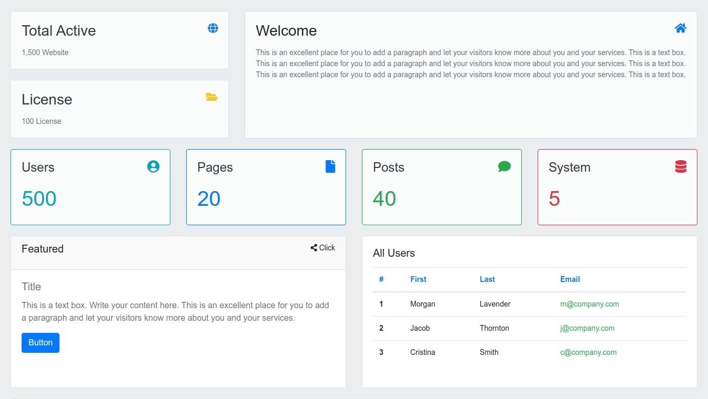

```html
<div class="container-fluid">
  <div class="row">
    <div class="col-md-4">
      <div class="row">
        <div class="col-md-12">
          <div class="card">
            <div class="card-body bg-light text-secondary">
              <div class="title">
                <h3 class="pull-left text-dark">Total Active</h3>
                <h5 class="pull-right text-primary">
                  <i class="fa fa-globe"></i>
                </h5>
              </div>
              <br clear="all" />
              <div class="">
                1,500 Website
              </div>
            </div>
          </div>
        </div>
      </div>
      <div class="row">
        <div class="col-md-12">
          <div class="card">
            <div class="card-body bg-light text-secondary">
              <div class="title">
                <h3 class="pull-left text-dark">License</h3>
                <h5 class="pull-right text-warning">
                  <i class="fa fa-folder-open"></i>
                </h5>
              </div>
              <br clear="all" />
              <div class="">
                100 License
              </div>
            </div>
          </div>
        </div>
      </div>
    </div>
    <div class="col-md-8">
      <div class="card bg-light" style="min-height: 243px;">
        <div class="card-body">
          <div class="title">
            <h3 class="pull-left">Welcome</h3>
            <h5 class="pull-right text-primary"><i class="fa fa-home"></i></h5>
          </div>
          <br clear="all" />
          <div class="text-secondary">
            This is an excellent place for you to add a paragraph and let your
            visitors know more about you and your services. This is a text box.
            This is an excellent place for you to add a paragraph and let your
            visitors know more about you and your services. This is a text box.
            This is an excellent place for you to add a paragraph and let your
            visitors know more about you and your services. This is a text box.
          </div>
        </div>
      </div>
    </div>
  </div>
  <div class="row">
    <div class="col-md-3">
      <div class="card bg-light text-info border border-info">
        <div class="card-body">
          <div class="title">
            <h4 class="pull-left text-dark">Users</h4>
            <span class="pull-right"><h4 class="fa fa-user-circle "></h4></span>
          </div>
          <br clear="all" />
          <div style="font-size:40px;" class="">
            500
          </div>
        </div>
      </div>
    </div>
    <div class="col-md-3">
      <div class="card bg-light text-primary border border-primary">
        <div class="card-body">
          <div class="title">
            <h4 class="pull-left text-dark">Pages</h4>
            <span class="pull-right"><h4 class="fa fa-file"></h4></span>
          </div>
          <br clear="all" />
          <div style="font-size:40px;" class="">
            20
          </div>
        </div>
      </div>
    </div>
    <div class="col-md-3">
      <div class="card bg-light text-success border border-success">
        <div class="card-body">
          <div class="title">
            <h4 class="pull-left text-dark">Posts</h4>
            <span class="pull-right"><h4 class="fa fa-comment"></h4></span>
          </div>
          <br clear="all" />
          <div style="font-size:40px;" class="">
            40
          </div>
        </div>
      </div>
    </div>
    <div class="col-md-3">
      <div class="card bg-light text-danger border border-danger">
        <div class="card-body">
          <div class="title">
            <h4 class="pull-left text-dark">System</h4>
            <span class="pull-right"><h4 class="fa fa-database"></h4></span>
          </div>
          <br clear="all" />
          <div style="font-size:40px;">
            5
          </div>
        </div>
      </div>
    </div>
  </div>

  <div class="row">
    <div class="col-md-6">
      <div class="card" style="min-height: 290px;">
        <div class="card-header">
          <h5 class="pull-left">Featured</h5>
          <span class="pull-right"><i class="fa fa-share-alt"></i> Click</span>
        </div>
        <div class="card-body text-secondary">
          <h5 class="card-title">Title</h5>
          <p class="card-text">
            This is a text box. Write your content here. This is an excellent
            place for you to add a paragraph and let your visitors know more
            about you and your services.
          </p>
          <a href="#" class="btn btn-primary">Button</a>
        </div>
      </div>
    </div>
    <div class="col-md-6">
      <div class="card" style="min-height: 290px;">
        <div class="card-body">
          <h5>All Users</h5>
          <table class="table">
            <thead>
              <tr class="text-primary">
                <th scope="col">#</th>
                <th scope="col">First</th>
                <th scope="col">Last</th>
                <th scope="col">Email</th>
              </tr>
            </thead>
            <tbody data-spy="scroll">
              <tr>
                <th scope="row">1</th>
                <td>Morgan</td>
                <td>Lavender</td>
                <td class="text-success">m@company.com</td>
              </tr>
              <tr>
                <th scope="row">2</th>
                <td>Jacob</td>
                <td>Thornton</td>
                <td class="text-success">j@company.com</td>
              </tr>
              <tr>
                <th scope="row">3</th>
                <td>Cristina</td>
                <td>Smith</td>
                <td class="text-success">c@company.com</td>
              </tr>
            </tbody>
          </table>
        </div>
      </div>
    </div>
  </div>

  <div class="row">
    <div class="col-md-12">
      <div class="card">
        <div class="card-body">
          <h4>All Users</h4>
          <table class="table">
            <thead>
              <tr class="text-primary">
                <th scope="col">#</th>
                <th scope="col">First</th>
                <th scope="col">Last</th>
                <th scope="col">Email</th>
              </tr>
            </thead>
            <tbody data-spy="scroll">
              <tr>
                <th scope="row">1</th>
                <td>Morgan</td>
                <td>Lavender</td>
                <td class="text-success">morgan@company.com</td>
              </tr>
              <tr>
                <th scope="row">2</th>
                <td>Jacob</td>
                <td>Thornton</td>
                <td class="text-success">jacob@company.com</td>
              </tr>
              <tr>
                <th scope="row">3</th>
                <td>Cristina</td>
                <td>Smith</td>
                <td class="text-success">cristina@company.com</td>
              </tr>
            </tbody>
          </table>
        </div>
      </div>
    </div>
  </div>
</div>
```
