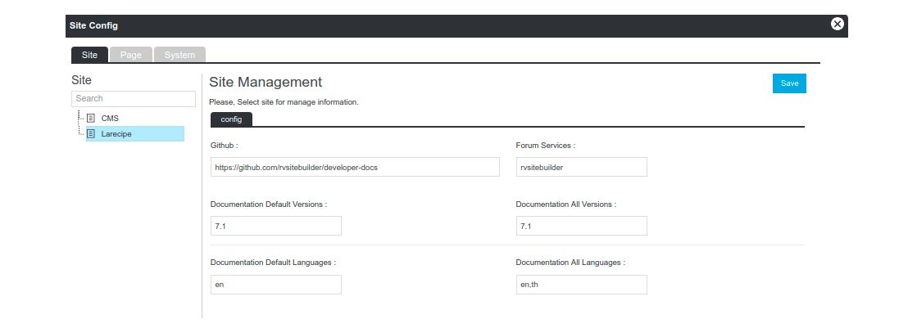
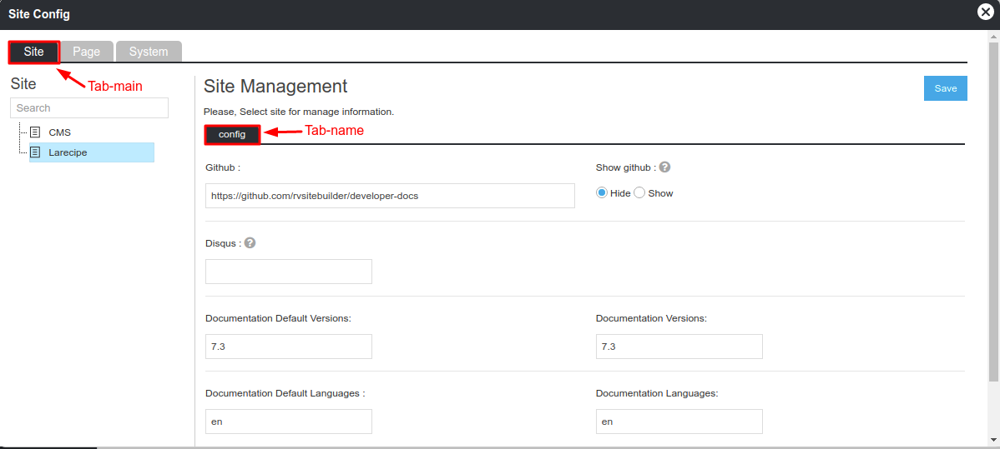

# App Configuration

- [Config](#config)
- [Register Config on App's Service Provider](#register-config-on-apps-service-provider)
- [Access App's Configuration](#access-apps-configuration)
- [Config Admin Interface](#config-admin-interface)
- [Event Open Admin Interface](#event-open-admin-interface)
- [Get Custom Values on your config file](#get-custom-values-on-your-config-file)
- [Config Form Request Validation](#config-form-request-validation)

> {info} If you are not familiar with its concept. Check out the full [Laravel Configuration documentation](https://laravel.com/docs/5.8/configuration) to get started.

## Config

Create Laravel config.php file and keep it in your `app’s /config` folder.

```php
/packages/vendor-name/project-name/
                    ├── config
```

Example of config.php

```php

use Rvsitebuilder\Core\Facades\RvsitebuilderService;
    return [
        'key' => 'value'
    ];
```

## Register Config on App's Service Provider

On your `app's service provider`, load your config under `register` method.

```php
public function register()
{
    $this->mergeConfigFrom(__DIR__.'/../config/config.php', 'vendor-name/project-name');
}
```

> {warning} At this state, Laravel still not bind all services. You are still not able to access database, do not call it on config.php.

## Access App's Configuration

The configuration values may be accessed using "dot" syntax, which includes the `vendor-name/project-name` declared on `mergeConfigFrom` and the `key` on the your config.php.

```php
config('vendor-name/project-name.key');
```

## Config Admin Interface

RVsitebuilder comes with the unified config admin interface on the admin manage app. Go to `apps launcher` choose manage, and choose `config` on the left menu.



To allow end-users change the value of your config online, you need to create a config blade file. And define it on your `app’s service provider`.

```php
public function boot()
{
    $this->defineConfigInterface();
}

protected function defineConfigInterface()
{
    // app('rvsitebuilderService')->siteConfigInterface('tab-name','app-name::blade-file-path');
    app('rvsitebuilderService')->siteConfigInterface('config','vendor-name/project-name::admin.config');
}
```

If you have a large configuration file, you may display it as multiple tabs by creating several config blade files, and call `siteConfigInterface` with different tab-name.

Here is an example of config blade file:

```html
<label>Github : </label>
<div class="">
  <input
    type="text"
    name="key"
    value="config('vendor-name/project-name.key')"
  />
</div>
```

`key` must exist on your `app’s config.php` otherwise it will not be allowed to save.

Saving config on `Config Admin Interface` will store values to database on `core_setting` table. There is an event/listener to rebuilt custom config to `/storage/dbconfig.json`. This will allow you continue to load config on the `register` method and safely run `artisan config:cache` if you wish.

If you modify config on table `core_setting` directly, you need to remove `/storage/dbconfig.json`. It will be re-generated automatcially.

## Event Open Admin Interface

If your open site config on your app's,and call `openConfig` with tab-main app-name and tab-name

Here is an example on your app's:

```html
//openConfig('tab-main','app-name','tab-name')
<a onclick="openConfig('site','rvsitebuilder/larecipe','tab-name')">
  Open Site Config</a
>
```



**`tab-main`** you can choose `site` just one.

**`app-name`** the name of the project. It consists of vendor name and project name.If you are not familiar with its `app-name` Check out the full [App Information](app-json-and-dependency.md) to get started.

**`tab-name`** your define it on `app’s service provider` call `siteConfigInterface` with tab-name

## Get Custom Values on your config file

Use `RvsitebuilderService::getConfig` to get the custom config values from `/storage/dbconfig.json` and fallback to the default value on your `app's config.php`.

```php
return
[
    'key' = RvsitebuilderService::getConfig('vendor-name/project-name.key', 'defaultValue')
]
```

## Config Form Request Validation

Saving config on `Config Admin Interface` will always go to `RVsitebuilder's config controller`. However, you can validate the input end-user made by creating ConfigFormRequest.php.

```text
/packages/vendor-name/project-name/
                    ├── config
                    ├── database
                    ├── routes
                    ├── public
                    ├── resources
                    ├── src
                    │   ├── AppServiceProvider.php
                    │   ├── Http
                    │   │   ├── Controllers
                    │   │   └── Requests
                    │   │   │   └── Admin
                    │   │   │       └── ConfigFormRequest.php
                    │   │   └── Middelware
```

And define it on your `app’s service provider`.

```php
protected function defineConfigInterface()
{
    app('rvsitebuilderService')->configRequestValidation('ConfigFormRequest');
}
```

Here is an example of config form request validation file:

```php
public function rules()
{
    return [
            'key' => 'required'
    ]
}
```
