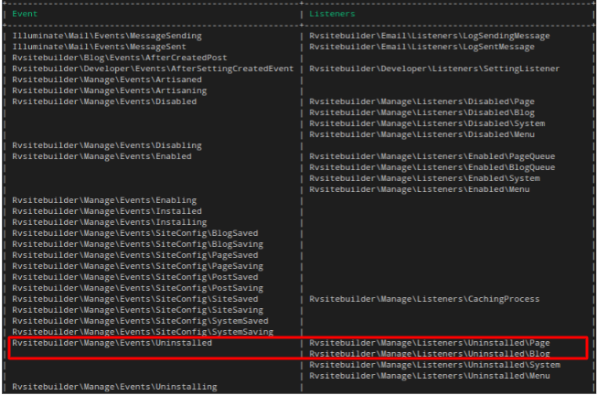

# App Event and Listener

> {info} If you are not familiar with its concept. Check out the full [Laravel Events documentation](https://laravel.com/docs/master/events) to get started.

- [Creating Event and Listener](#creating-event-and-listener)
- [Eloquent Model Events](#eloquent-model-events)
- [RVsitebuilder Application Events](#rvsitebuilder-application-events)
- [Register Event on App’s Service Provider](#register-event-on-apps-service-provider)
- [Register Listener on App’s Event Service Provider](#register-listener-on-apps-event-service-provider)
  - [Listener](#listener)

<a name="Creating-Event-and-Listener"></a>

## Creating Event and Listener

<!-- TODO: @pairote ยังขาด listener, observer, subscriber  -->

Create Laravel blade file and keep it in your `app’s /src/Events` folder.

```php
/packages/vendor-name/package-name/
                    ├── src
                    │   ├── Events
                    │   │   ├── Uninstaling.php
                    │   │   ├── Uninstalled.php
```

<a name="Eloquent-Model-Events"></a>

## Eloquent Model Events

Eloquent models fire several events **automatically**, allowing you to hook into the following points in a model's lifecycle: retrieved, creating, created, updating, updated, saving, saved, deleting, deleted, restoring, restored.

> {info} Check out the [Laravel Eloquent Events documentation](https://laravel.com/docs/master/eloquent#events) to get started.

<a name="RVsitebuilder-Application-Events"></a>

## RVsitebuilder Application Events

<!-- TODO: @apiruk ตรวจสอบว่าทำไม แสดงผลไม่ครบ ของ framework และ ของ เรา ไม่แสดงผล-->

You can find the full list of events using Artisan command.

```php
php artisan event:list
```

<!-- TODO: @apiruk ต้องปรับปรุงแก้ไขหัวข้อ manage hook https://app.clickup.com/t/t523b  และ เขียน document ให้ถูกด้วยครับ -->



<a name="Register-Event-on-App-Service-Provider"></a>

## Register Event on App’s Service Provider

<!-- TODO: @pairote ขยายความ  -->

```php
php artisan make:event Installing
```

```php
    class Installing
    {
        use SerializesModels;

        public function __construct(Request $request)
        {
            $this->request = $request;
        }

        public function broadcastOn()
        {
            return [];
        }
    }
```

<a name="Register-Listener-on-App-Service-Provider"></a>

<!-- TODO: @pairote ขยายความ  -->

## Register Listener on App’s Event Service Provider

```php
/packages/vendor-name/project-name/
                    ├── src
                    │   ├── Listeners
                    │   │   ├── Uninstaling.php
                    │   │   ├── Uninstalled.php
                    │   │   |   ├── Post.php
                    │   │   |   ├── page.php
```

### Listener

Set Listeners On App’s EventServiceProvider.php

```php
    class EventServiceProvider extends ServiceProvider
    {
        protected $listen = [
        \vendorName\ProjectName\Events\Uninstaling::class => [
        ],

        \vendorName\ProjectName\Events\Uninstalled::class => [
            \Rvsitebuilder\Manage\Listeners\Uninstalled\Post::class,
            \Rvsitebuilder\Manage\Listeners\Uninstalled\Page::class,
        ],
    }
```

```php

class Post
{
    /*
     * event(new Uninstalled($request));
     */
    public function handle(Uninstalled $event)
    {
        $manageApp = ManageApp::withTrashed()
                                ->where('app_name', $event->request->appsName)
                                ->pluck('enabled_data')
                                ->first();

        $data = collect(json_decode($manageApp, true))->recursive();

        if ($data->get('post')->has('id')) {
            BlogPost::withTrashed()
                    ->whereIn('id', $data->get('post')->get('id')->toArray())
                    ->forceDelete();

            BlogPostCategory::withTrashed()
                            ->whereIn('post_id', $data->get('post')->get('id')->toArray())
                            ->forceDelete();
        }
    }

```
