- [Create Widget](#CreateWidget)
- [Webpack](#Webpack)
- [Color Picker](#ColorPicker)

# Create Widget

<a name="CreateWidget"></a>
จะอธิบายตั้งแต่เริ่มสร้าง app
ไปที่ rightbar on top click Apps แล้วเลือก 
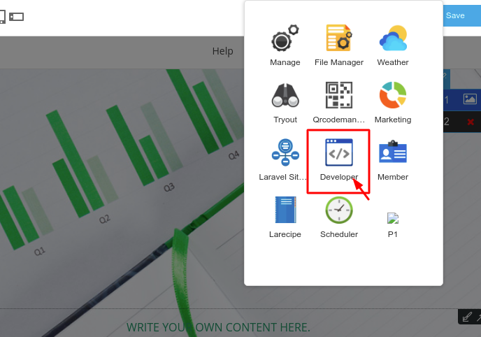
<br>
เลือก Generate App 
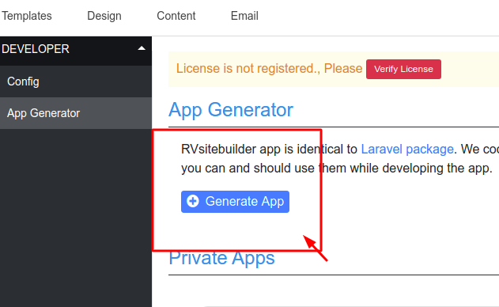
<br>
เราจะทดสอบสร้าง appขึ้นมาแบบ ง่ายๆ โดยใช้ชื่อ App name ว่า "vendor-name" และชื่อ project name ว่า "project-name"
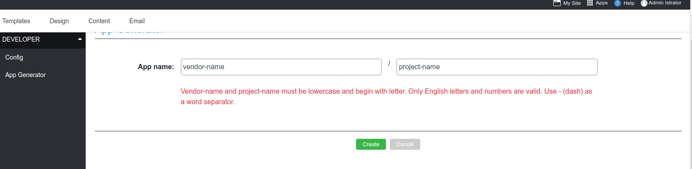

กดสร้างที่ generator widget
<br>
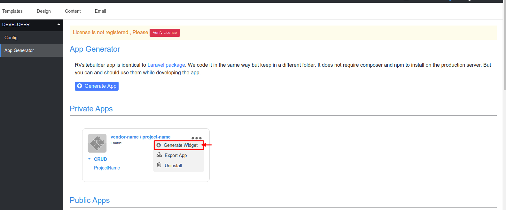
<br>
ตั้งชื่อ widget ที่จะทดสอบว่า "widget-colorpicker"
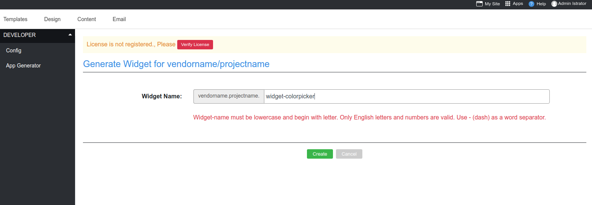
<br>
หลังจากนั้นให้กลับไปที่หน้า "Content"
<br>
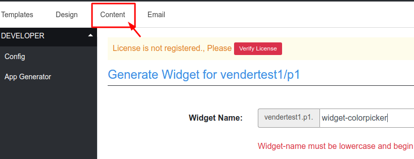
เราจะเห็นwidgetที่ถูกสร้างขึ้นมา 2 ที่ ดังรูป
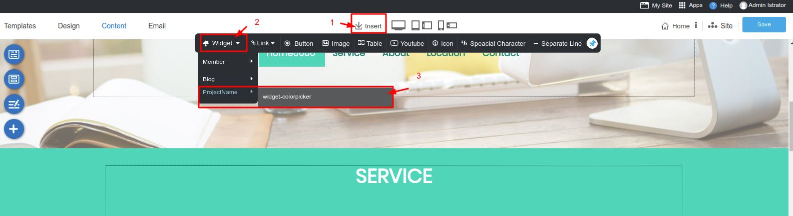
<br>
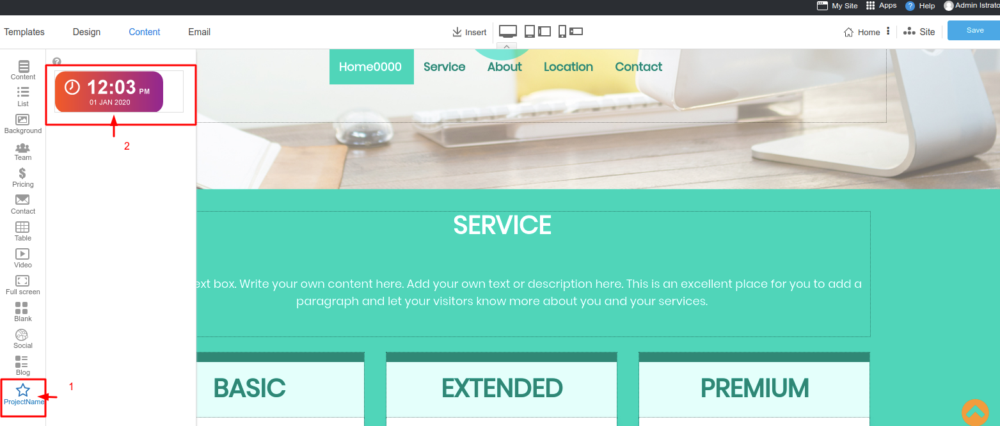
<br>
ให้ทดสอบ insert widget ลงใน editor จะ insert แบบไหนก็ได้ แต่ในตัวอย่างจะ insert แบบ section
จะเห็น panel ขึ้นมาด้านขวาเราจะใส่ colorpickerในนั้น
<br>
ทดสอบวาง widget ที่สร้าง
<br>
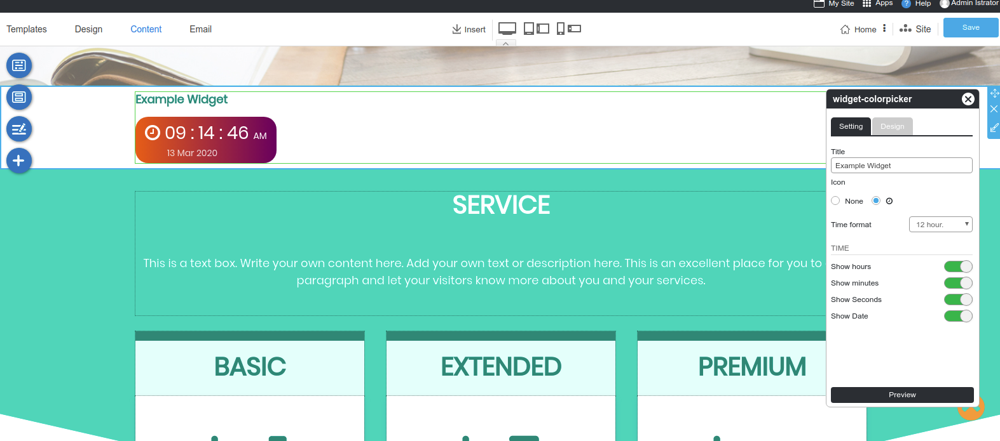
ถ้าต้องการทดสอบ เฉพาะ panel และไม่อยากทดสอบในหน้า content สามารถทดสอบบน address bar ได้โดยใส่ดังนี้ "http://localhost/admin/wysiwyg/common/widgetframe/vendor-name/project-name/widget-colorpicker"
<br>
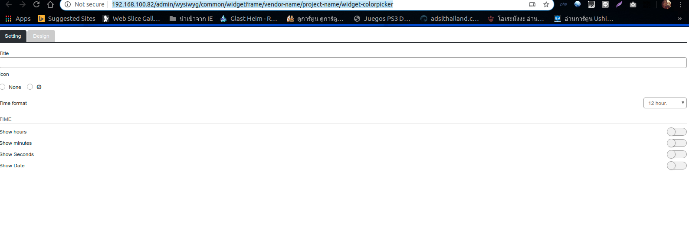

# Webpack

<a name="Webpack"></a>
แนะนำให้ดู create widget ก่อน [Create Widget](createwidget.md)
ขั้นตอนการใส่ javascript ใช้งานร่วมกับ webpack โดยจะอธิบายการเรียกใช้ "colorpicker" จาก node_module ให้ใช้งานร่วมกับ widget ได้อย่างไรดังนี้
ต้องติดตั้ง node_module ก่อนที่ packages/vendor-name/project-name

```php
cd /localhost/packages/vendor-name/project-name
npm run install
```

ให้เปิดไฟล์ packages/vendor-name/project-name/webpack.mix.js
ใส่ code ดังนี

```php
mix.js(
    'resources/js/admin/widget-colorpicker.js',
    'js/widget-colorpicker.js.js'
);
mix.sass(
    'resources/css/widget-colorpicker.scss',
    'public/css/widget-colorpicker.css'
);

```

แนะนำให้ดู [laravel mix](https://laravel.com/docs/7.x/mix)
<br>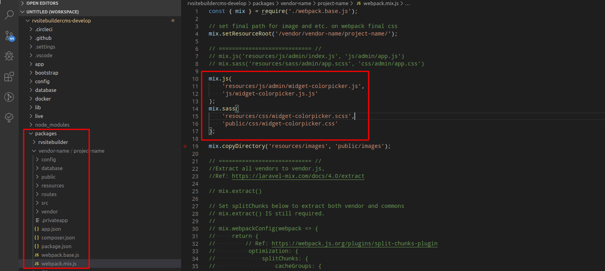

ให้สร้างไฟล์ 'packages/vendor-name/project-name/resources/js/admin/widget-colorpicker.js'
ให้ใส่ code

```php
import 'spectrum-colorpicker';
```

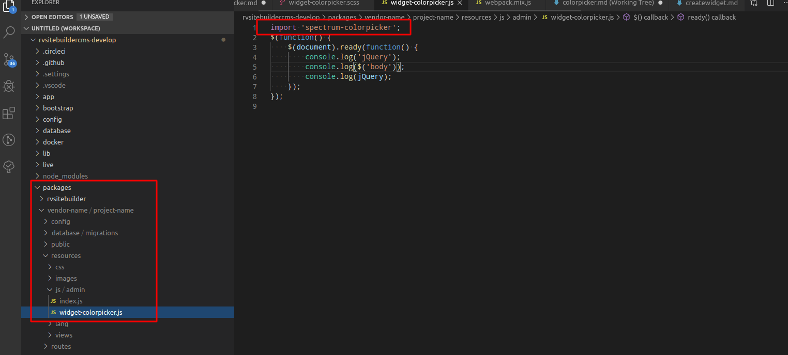

ให้สร้างไฟล์ 'packages/vendor-name/project-name/resources/css/widget-colorpicker.scss'
ให้ใส่ code

```css
@import '~spectrum-colorpicker/spectrum';
```

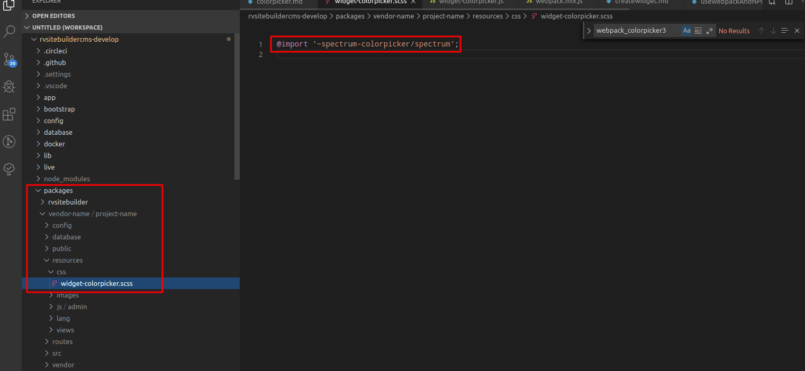
หลังจากนั้นให้ npm run dev เพื่อให้ webpack สร้างไฟล์ขึ้นมา แนะนำให้ดูข้อมูล [laravel mix](https://laravel.com/docs/6.x/mix)

```php
จากตัวอย่าง
cd /localhost/packages/vendor-name/project-name/
npm run dev
```

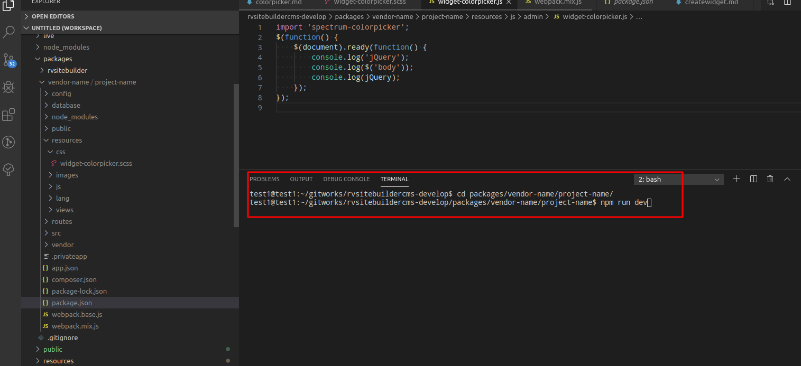
\*\*\* ถ้าเราเขียน script หรือ เปลี่ยนแปลงในไฟล์ นี้
packages/vendor-name/project-name/resources/js/admin/widget-colorpicker.js
packages/vendor-name/project-name/resources/css/widget-colorpicker.scss
จำเป็นต้อง npm run dev
ถ้าสำเร็จแล้วไม่มีปัญหาจะขึ้นดังรูป
<br>
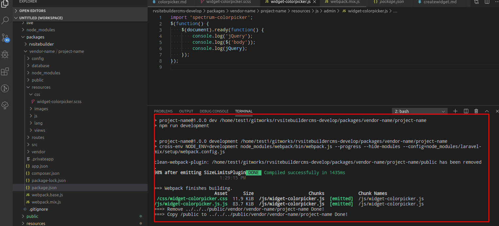
<br>

# Color Picker

<a name="ColorPicker"></a>
การใส่ colorpicker ลงบน panel ดังภาพที่2
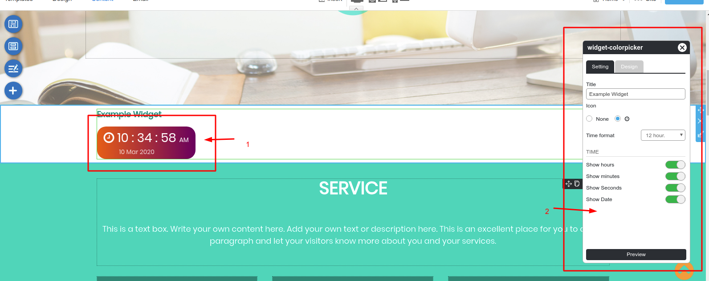
ให้เปิดไฟล์ packages/vendor-name/project-name/resources/views/widgets/widget-colorpicker/panel.blade.php
<br>
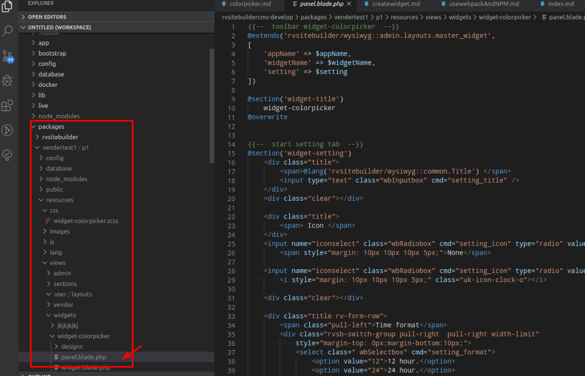
<br>
ให้ใส่ script แบบนี้ล่างสุดของไฟล์ panel.blade.php

```php
<label for="widget-colorpicker-input">
    <input type="text" name="radio" class="wbSetcolor" id="widget-colorpicker-input" >
</label>
@push('package-styles')
{{ style(mix('css/widget-colorpicker.css', 'vendor/vendertest1/p1')) }}	// เชื่อมต่อกับไฟล์ js ใน webpack
@endpush
@push('package-scripts')
{{ script(mix('js/widget-colorpicker.js', 'vendor/vendertest1/p1')) }} // เชื่อมต่อกับไฟล์ js ใน webpack
<script>
$(function() {
  // Handler for .ready() called.
    $( document ).ready(function() {
        $('.wbSetcolor').spectrum({
            showAlpha: true,
            showInput: true,
            allowEmpty: true,
            preferredFormat: 'rgb',
            change: function(color) {
                var fb = parent.$('#frameBody').get(0).contentWindow; //ถ้าต้องการเชื่อมกับ wys ให้เรียก ผ่านตัวนี้ เพราะ editor มีการทำงาน frame หลายชั้น
                var id = parent.elmSetWidget.get(0).id;
                fb.$('#' + id).attr('setting_color', color.toHexString());
            },
        });

    });
});

</script>
@endpush
```

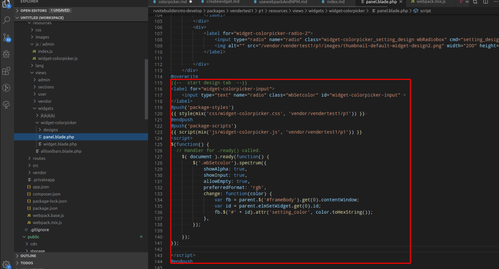
<br>
ให้ทดสอบผลในหน้า editor จะแสดง icon colorpicker 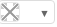ขึ้นมา
<br>
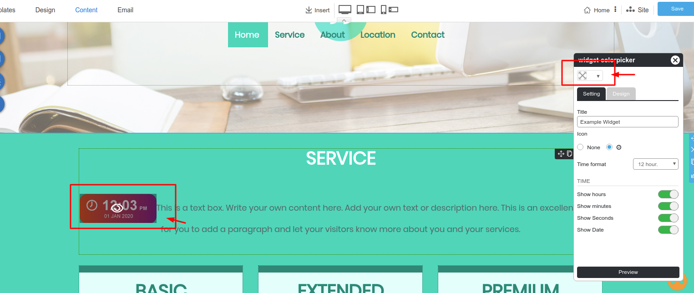
<br>
จะอธิบายเรื่อง tab panel จะมี 2 tab ชื่อ setting และ design
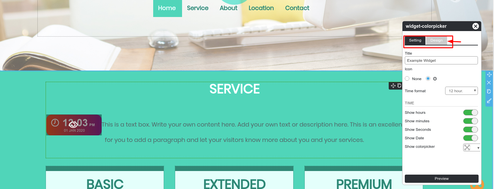
<br>
<b>setting</b> จะสัมพันธ์กับ'-- start setting tab &#123;&#123;--'ข้อมูลที่อยู่ในนี้จะแสดงใน tab setting '--&#125;&#125; end setting tab --'
<br>
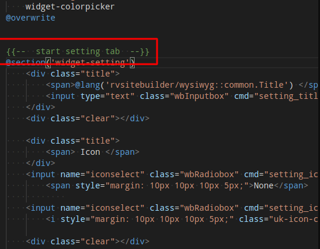
<br>
<b>design</b> จะสัมพันธ์กับ'-- start design tab &#123;&#123;--'ข้อมูลที่อยู่ในนี้จะแสดงใน tab setting '--&#125;&#125; end design tab --'
<br>
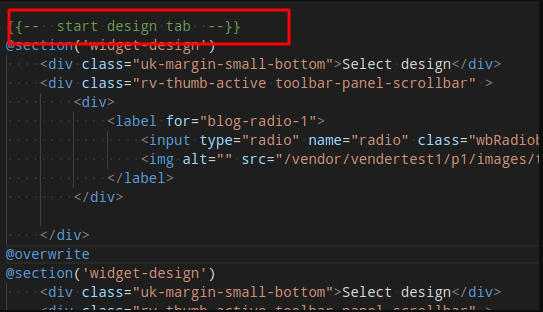
