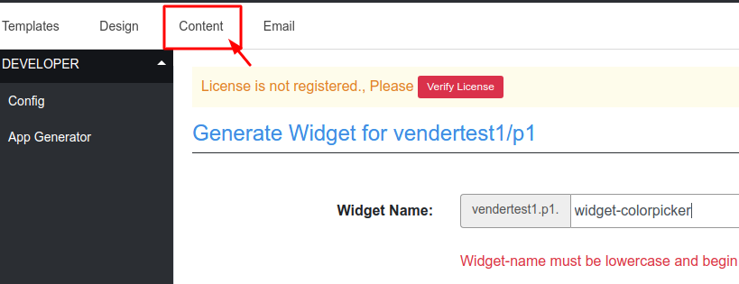
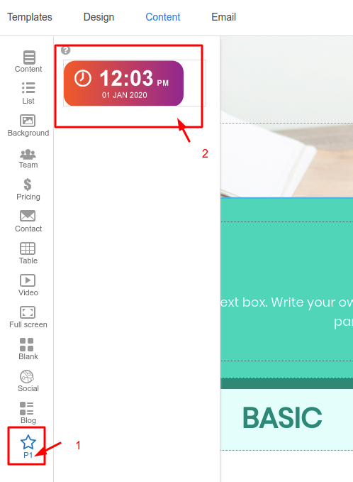
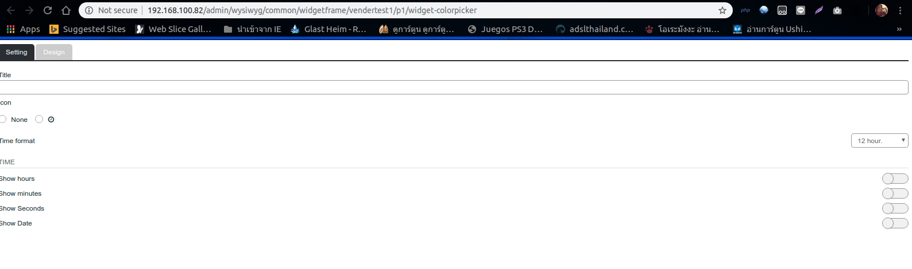
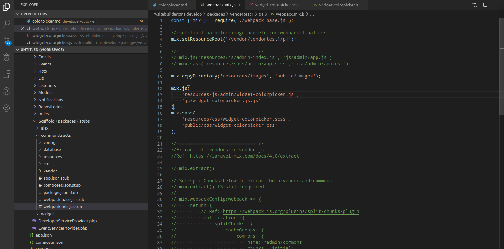

# Color Picker

จะอธิบายตั้งแต่เริ่มสร้าง app
ไปที่ rightbar on top click Apps แล้วเลือก 

 
เลือก Generate App 

 
เราจะทดสอบสร้าง appขึ้นมาแบบ ง่ายๆ โดยใช้ชื่อ App name ว่า "Test Apps" และชื่อ project name ว่า "proj1"

กดสร้างที่ generator widget
 

 
ตั้งชื่อ widget ที่จะทดสอบว่า "widget-colorpicker"

 
หลังจากนั้นให้กลับไปที่หน้า "Content"
 

เราจะเห็นwidgetที่ถูกสร้างขึ้นมา 2 ที่ ดังรูป

 

ให้ทดสอบ insert widget ลงใน editor จะ insert แบบไหนก็ได้ แต่ในตัวอย่างจะ insert แบบ section
จะเห็น panel ขึ้นมาด้านขวาเราจะใส่ colorpickerในนั้น
 

ถ้าไม่อยากทดสอบในหน้า content สามารถทดสอบบน address bar ได้ โดยใส่ ดังนี้ " http://192.168.100.82/admin/wysiwyg/common/widgetframe/vendertest1/p1/widget-colorpicker "
 

ขั้นตอนการใส่ javascript ใช้งานร่วมกับ webpack โดยจะอธิบายการเรียกใช้ colorpicker จาก node_module ให้ใช้งานร่วมกับ widget ได้อย่างไรดังนี้

ให้เปิดไฟล์ packages/vendertest1/pi/webpack.mix.js
 

## Editor ready

โดยส่วนใหญ่จะเอาไว้เก็บ event หลักของ toolbar (เป็น toolbar หลักที่ไม่อยากให้ไปปะปนกับ template หลายๆ toolbar จะไว้ที่นี้)เช่น ปุ่มเปลี่ยนfont, ปุ่มเปลี่ยนตัวหน้า, ตัวเอียง, ปุ่มinsert, table, youtube ปุ่มหลักๆที่อยู่บน topbar และ panel
 
