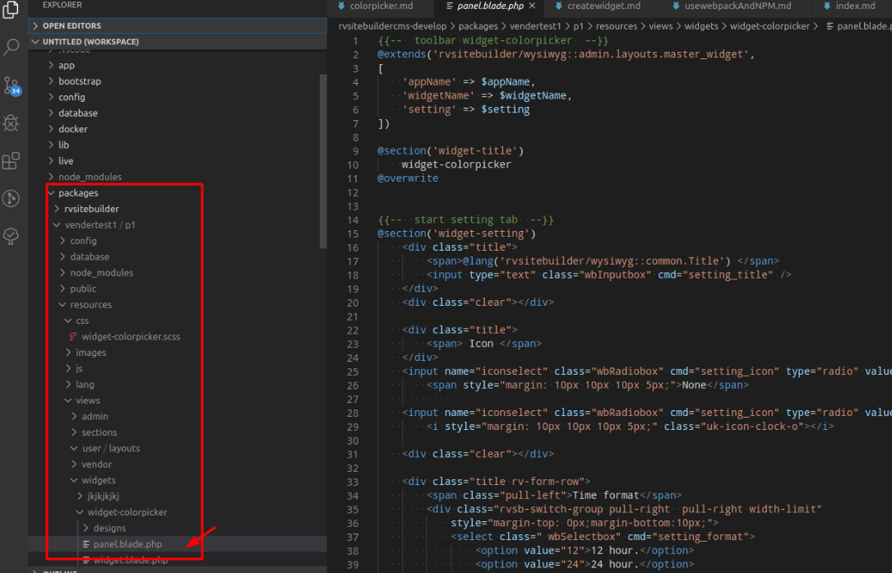
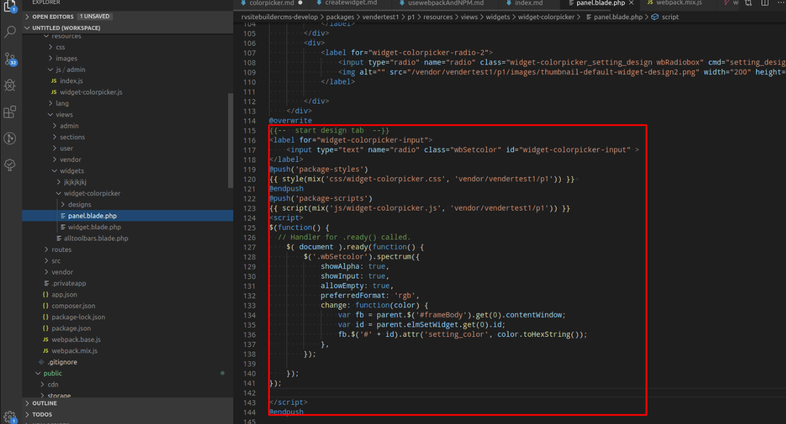

# Color Picker

หลังจากที่ [Create Widget](createwidget.md) และ เตรียมไฟล์  [Webpack](usewebpackAndNPM.md) แล้ว
จะอธิบายการใส่ colorpicker ลงบน panel ดังภาพที่2

ให้เปิดไฟล์ packages/vendertest1/p1/resources/views/widgets/widget-colorpicker/panel.blade.php
<br>

<br>
ให้ใส่ script แบบนี้ล่างสุดของไฟล์ panel.blade.php
```php
<label for="widget-colorpicker-input">
    <input type="text" name="radio" class="wbSetcolor" id="widget-colorpicker-input" >
</label>
@push('package-styles')
{{ style(mix('css/widget-colorpicker.css', 'vendor/vendertest1/p1')) }}	// เชื่อมต่อกับไฟล์ js ใน webpack
@endpush
@push('package-scripts')
{{ script(mix('js/widget-colorpicker.js', 'vendor/vendertest1/p1')) }} // เชื่อมต่อกับไฟล์ js ใน webpack
<script>
$(function() {
  // Handler for .ready() called.
    $( document ).ready(function() {
        $('.wbSetcolor').spectrum({
            showAlpha: true,
            showInput: true,
            allowEmpty: true,
            preferredFormat: 'rgb',
            change: function(color) {
                var fb = parent.$('#frameBody').get(0).contentWindow; //ถ้าต้องการเชื่อมกับ wys ให้เรียก ผ่านตัวนี้ เพราะ editor มีการทำงาน frame หลายชั้น
                var id = parent.elmSetWidget.get(0).id;
                fb.$('#' + id).attr('setting_color', color.toHexString());
            },
        });

    });
});

</script>
@endpush
```


