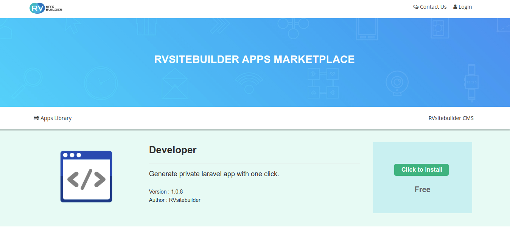

# Creating New App

- [Public App](#public-app)
- [Creating App](#creating-app)
- [Exporting App](#exporting-app)
- [Importing Private App](#importing-private-app)
- [Submitting App to Marketplace](#submitting-app-to-marketplace)

## Public App

You can find public apps on [RVsitebuilder App Marketplace](https://apps.rvsitebuilder.com/). Applications to make your website to be more powerful and functional.

## Creating App

Build your own app no more easier. We provide Developer app on RVsitebuilder marketplace that help you create a new app. Save you a lot of time manually create app scaffolding.

1. Go to RVsitebuilder App Marketplace, and find [Developer App](https://apps.rvsitebuilder.com/developer).

2. Click install and choose your local development website to install. If your local domain does not on the domain list, please login as admin on your local development and try again.
3. Once successfully install on your local website, click `App launcher` and go to Developer app.
4. Click 'Generate app' on the developer page.

You will get basic scarfolding consist of migration, resources, model, controller, and view to start with.

## Exporting App

//TODO: @pram export app

## Importing Private App

//TODO: @pram import app

## Submitting App to Marketplace

We are building marketplace app to facilitate app publishing activities including the payment system. If you want to submit free public app, please submit [ticket](https://rvglobalsoft.com/tickets/new&deptId=5) here. For paid apps, please wait for announcement soon.
