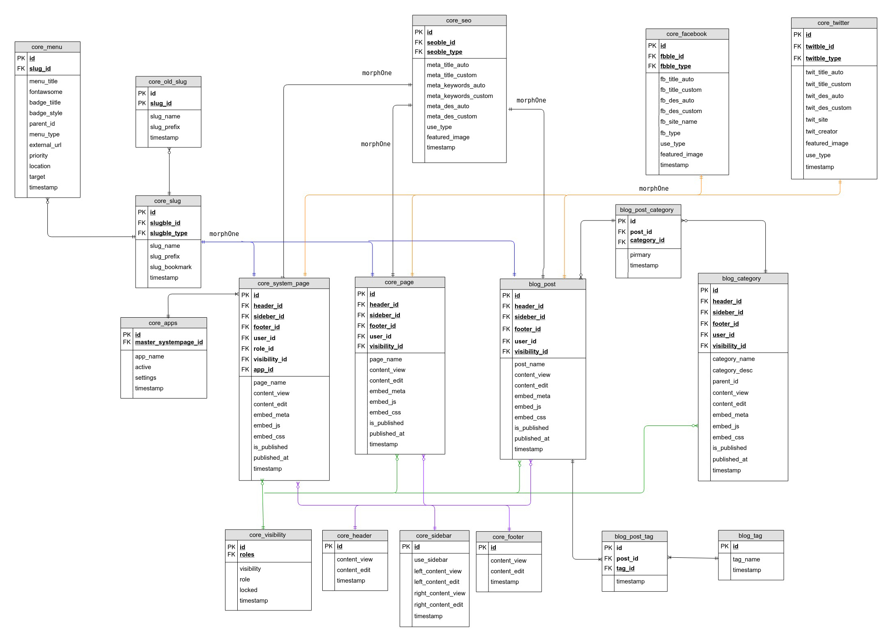
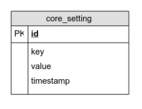
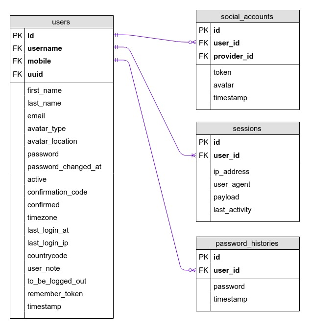
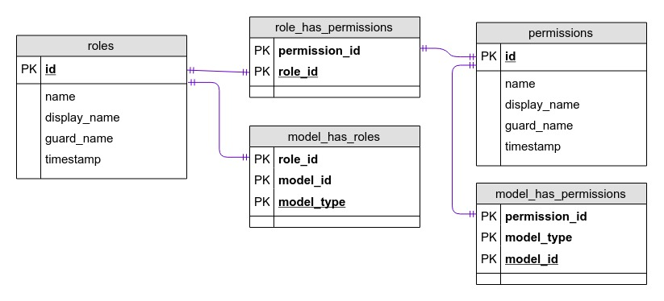
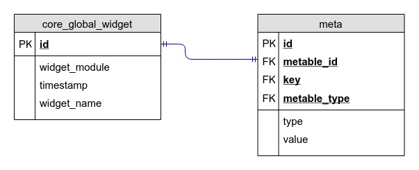
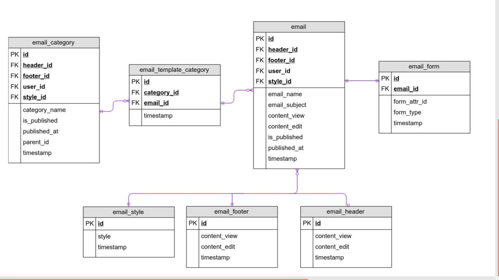
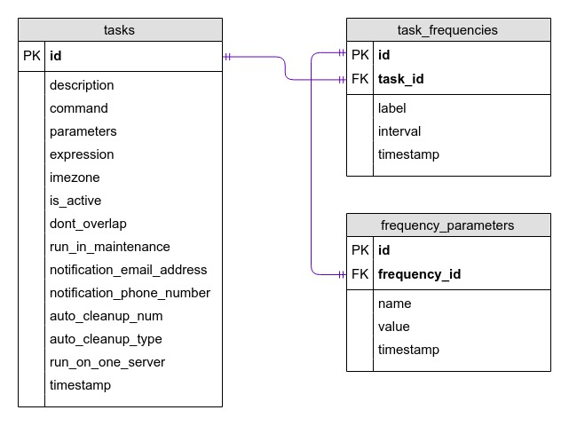

# Database Structure

  
## CMS features  

Several tables contain Page, Blog, Menu, Header, footer, Slug, SEO, and etc. to build dynamic website.

### Old-slug

Renaming page, post, and category slug will keep the old slug and automatically redirect to the new slug.

## Core-setting

This table is used to store custom configuration from `Config Admin Interface` before creating config cache. Check [App Configuration](app-configuration.md) for more detail.

## User

 

## Role and Permissions

## Meta
Extending default table using meta table. Check [App Model](app-model.md) for more detail.

## Email

## Scheduled tasks

