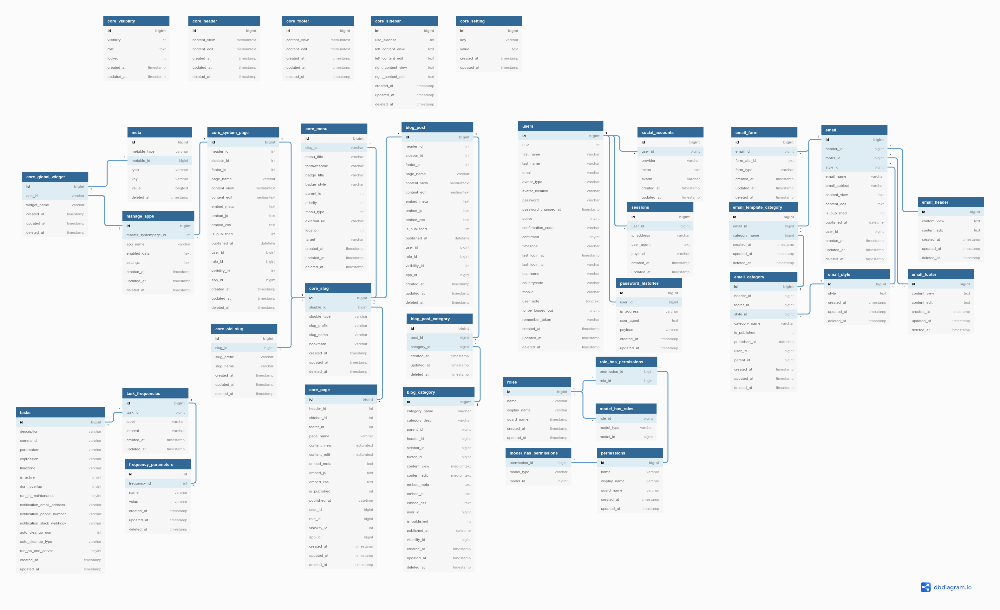
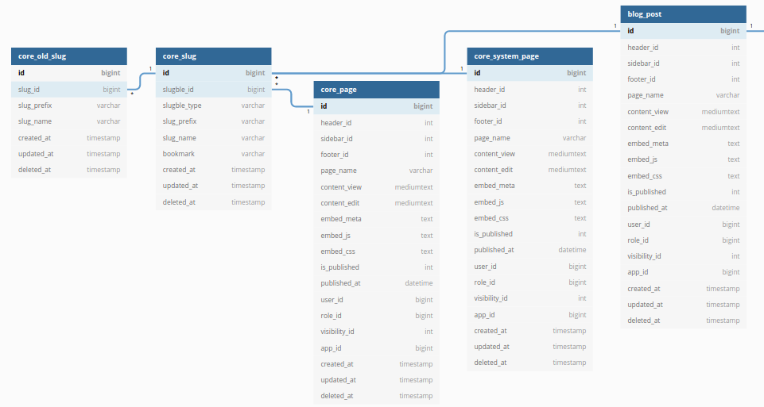

# Database Structure

-   [CMS features](#cms-features)
-   [Manage app](#manage-app)
-   [Slug](#slug)
-   [Page and Menu](#page-and-menu)
-   [Blog](#blog)
-   [Core setting](#core-setting)
-   [User](#user)
-   [Role and Permissions](#role-and-permissions)
-   [Widget and Meta](#widget-and-meta)
-   [Email](#email)
-   [Scheduled tasks](#scheduled-tasks)

## CMS features

Several tables contain Page, Blog, Menu, Header, footer, Slug, SEO, and etc. to build dynamic website.

## Manage app

This table is manage all app in CMS.

## Slug

Renaming page, post, and category slug will keep the old slug and automatically redirect to the new slug.

## Page and Menu

## Blog

## Core setting

This table is used to store custom configuration from `Config Admin Interface` before creating config cache. Check [App Configuration](app-configuration.md) for more detail.

## User

## Role and Permissions

## Widget and Meta

Extending default table using meta table. Check [App Model](app-model.md) for more detail.

## Email

## Scheduled tasks

