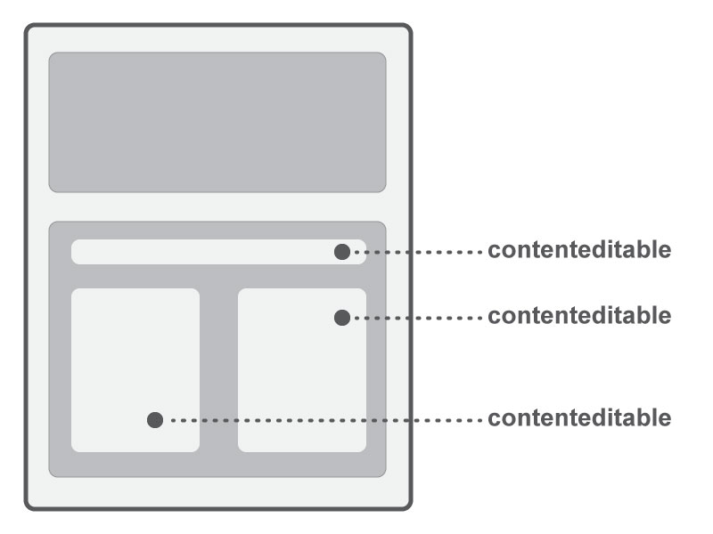

# Editable event

หน้า wysiwyg จะมี contentEdiable กระจัดกระจายอยู่เพื่อให้สามารถพิมแก้ไขข้อความหรือใส่รูปใส่designได้
จะสามารถใส่ event ต่างๆของ [jquery](https://api.jquery.com/category/events/) ได้ทั้งหมด ต้องผ่าน function RVwys.designViewAddEvent()

ตัวอย่าง

```js
<script>
    $(function() {
  	    RVwys.designViewAddEvent('mousedown', function (e) {
            console.log('mousedown tag '+$(e.target).tagName)
          }

        RVwys.designViewAddEvent('click', function (e) {
            console.log('click tag '+$(e.target).tagName)
          }
    });

</script>
```
