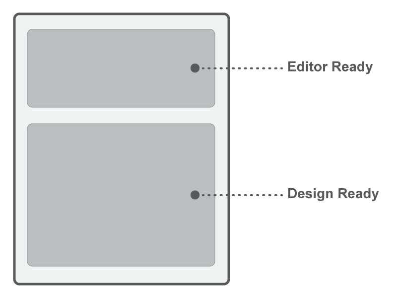

# Event Editor ready

ในหน้า wysiwyg จะมี iframe 2 ส่วนและจะมี event ของใครของมันที่ชื่อว่า editorReady,designReady จะทำงานแยกกันโดยมี iframe มากันการทำงานโดยมีลักษณะเป็น event ของ Editor การทำงานเหมือนกับ [jquery ready](https://api.jquery.com/ready/)การทำงานแตกต่างกันดังนี้


## Editor ready

โดยส่วนใหญ่จะเอาไว้เก็บ event หลักของ toolbar (เป็น toolbar หลักที่ไม่อยากให้ไปปะปนกับ template หลายๆ toolbar จะไว้ที่นี้)เช่น ปุ่มเปลี่ยนfont, ปุ่มเปลี่ยนตัวหน้า, ตัวเอียง, ปุ่มinsert, table, youtube ปุ่มหลักๆที่อยู่บน topbar และ panel
<br>
ตัวอย่างการใช้งาน.

```js
<script>
  $(function(){" "}
  {$(document).bind("editorReady", function() {
    alert("editor ready ");
    $("body").click(function() {
      //event action
    });
  })}
  );
</script>
```

## Design ready

เป็น event ที่มีจำเป็นต้องอยู่ภายในtemplate กรณ๊ที่ editorready ไม่สามารถทำงานได้ เช่น drag&drop event คือต้องการจะทำ designสำหรับลากมาวางลงบน template (ขอให้ใช้ในกรณีจำเป็นข้างต้นเท่าน้น เพราะ script ที่ขียนอาจจะไปรบกวนการทำงานของ template ทำให้เสียหายหรือพังได้)

```js
<script>
  $(function(){" "}
  {$(document).bind("designReady", function() {
    alert("widget ready ");
    $("body").click(function() {
      //event action
    });
  })}
  );
</script>
```
