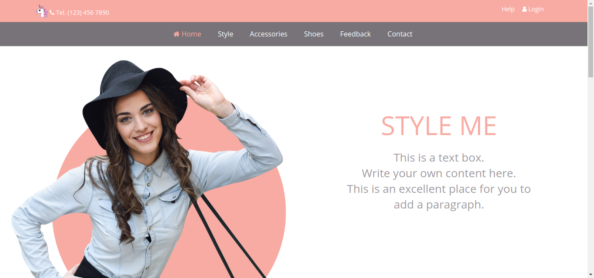
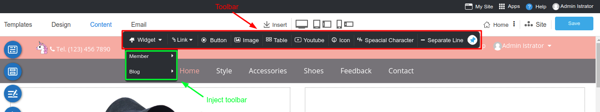
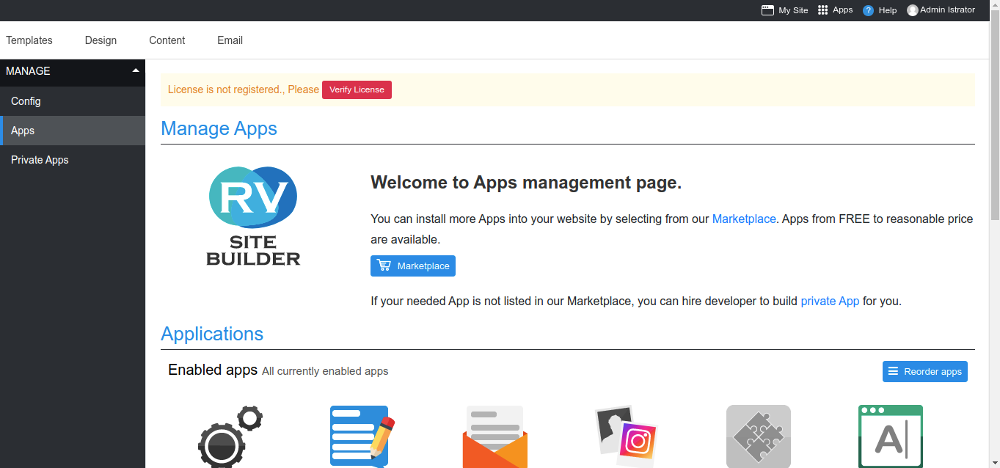
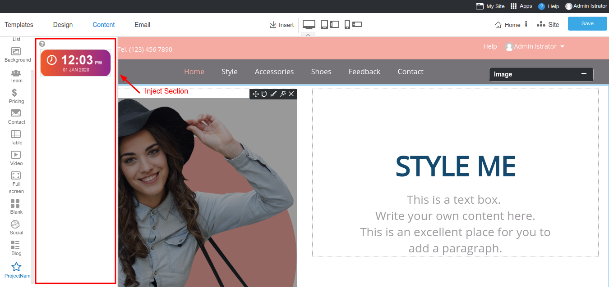

# Extending WYSIWYG

- [Overview](#overview)
- [Inject Services](#inject-services)
- [Frontend Event Hooks](#frontend-event-hooks)
- [Backend Event Hooks](#backend-event-hooks)

<a name="Overview"></a>

## Overview

Usually what you do on your app will run under your own route, what if you want to inject your code to other app's route such as RVsitebuilder's WYSIWYG. Thanks to `Laravel blade's @inject` method. This open possibility to inject your code to our app.

<a name="Inject-Services"></a>

## Inject Services

To inject your code to WYSIWYG, your need to define your blade file to inject on your `app's service provider`.

On your `app's service provider`, load your application events under boot method.

```php
public function boot()
{
    $this->defineinject();
}
```

Define injections to insert code to display on other apps.

```php
public function defineinject()
{
    app('rvsitebuilderService')->inject('inject-name','vendor-name/package-name::view blade file');
}
```

### Viewmode



You can inject to viewmode will stay in `</body>`.

```php
app('rvsitebuilderService')->inject('viewmode','vendor-name/package-name::view blade file');
```

<!-- TODO: @tanawat inject admin-->

### Toolbar

You can add your widget to our Tools -> Widget in WYSIWYG by using Inject Toolbar.

Example code.

```php
app('rvsitebuilderService')->inject('toolbar','vendor-name/package-name::view blade file');

```

Result is below


### Editmode



Adding Section objects

```php
app('rvsitebuilderService')->inject('editmode','vendor-name/package-name::view blade file');
```

### Section



```php
app('rvsitebuilderService')->inject('section','vendor-name/package-name::view blade file');
```

### Insert

<a name="Frontend-Event-Hooks"></a>

## Frontend Event Hooks

<!-- TODO: @june Backend Event Hooks -->

### beforeSave

### afterSave

### completeSave

<a name="Backend-Event-Hooks"></a>

## Backend Event Hooks

<!-- TODO: @pram Backend Event Hooks -->

### Saving event

### Saved event
