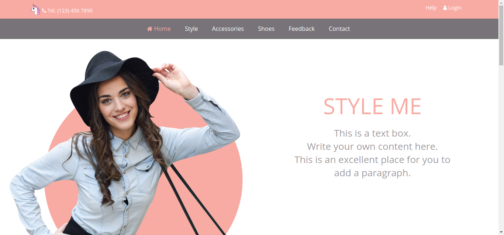
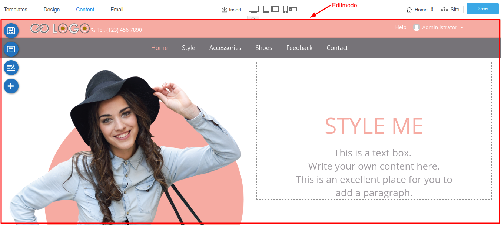
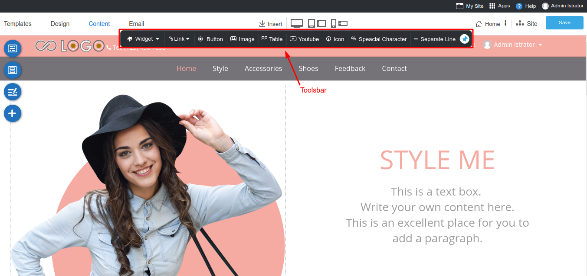
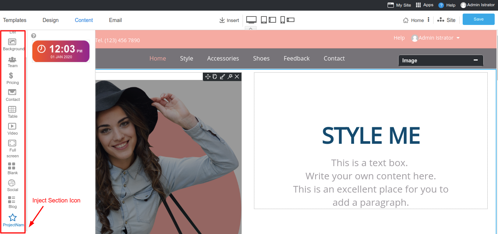
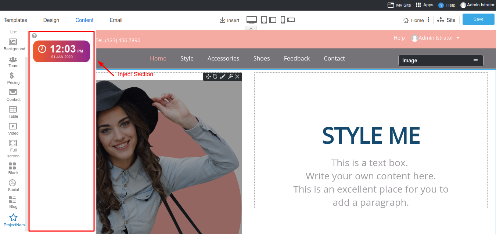

# Extending WYSIWYG

- [Overview](#overview)
- [Inject Services](#inject-services)
  - [Inject name](#inject-name)
  - [Viewmode](#viewmode)
  - [Editmode](#editmode)
  - [Toolbar](#toolbar)
  - [Section_icon](#section_icon)
  - [Section](#section)

<a name="Overview"></a>

## Overview

Usually what you do on your app will run under your own route, what if you want to inject your code to other app's route such as RVsitebuilder's WYSIWYG. Thanks to `Laravel blade's @inject` method. This open possibility to inject your code to our app.

<a name="Inject-Services"></a>

## Inject Services

To inject your code to WYSIWYG, your need to define your blade file to inject on your `app's service provider`.

On your `app's service provider`, load your application events under boot method.

```php
public function boot()
{
    $this->defineinject();
}
```

Define injections to insert code to display on other apps.

```php
public function defineinject()
{
    app('rvsitebuilderService')->inject('inject-name','vendor-name/project-name::view blade file');
}
```

### Inject name

| inject Service User | inject Service Admin |
| :-----------------: | :------------------: |
|      viewmode       |       toolbar        |
|      editmode       |     section_icon     |
|                     |       section        |


### Viewmode

You can add your code to our viewmode by using `Inject viewmode`.

Example code :

```php
app('rvsitebuilderService')->inject('viewmode','vendor-name/project-name::view blade file');
```

Result is below :


### Editmode
User's website while editing from admin interface displays under `WYSIWYG toolbars` is `editmode`. 

Example code :

```php
app('rvsitebuilderService')->inject('editmode','vendor-name/project-name::view blade file');
```

Result is below :



### Toolbar

You can add your widget to our `Tools -> Widget` in WYSIWYG by using `Inject Toolbar`.

Example code :

```php
app('rvsitebuilderService')->inject('toolbar','vendor-name/project-name::view blade file');
```

Result is below :



### Section_icon

You can add your icon widget to our `Content -> Section` in WYSIWYG by using `Inject Section Icon`.

Example code :

```php
app('rvsitebuilderService')->inject('section_icon','vendor-name/project-name::view blade file');
```

Result is below :


### Section

You can add your widget to our `Content -> Section` in WYSIWYG by using `Inject Section`.

Example code :

```php
app('rvsitebuilderService')->inject('section','vendor-name/project-name::view blade file');
```

Result is below :


> {info} If you are not familiar with its `widget design`. Check out the full [RVsitebuilder Widget](rvsitebuilder-widget.md) to get started.
