# Installation

- [Getting a developer license](#getting-a-developer-license)
- [Server Requirement](#server-requirement)
- [RVsitebuilder Docker](#rvsitebuilder-docker)
- [RVsitebuilder Web Installation](#rvsitebuilder-web-installation)
  - [Create Database on cPanel](#create-database-on-cpanel)
  - [Create Database on Direct Admin](#create-database-on-direct-admin)
- [.env configuration](#env-configuration)

## Getting a developer license

You can install RVsitebuilder locally on your work station for developing purpose. Please register to [RVsitebuilder Register](https://dev.rvsitebuilder.com/) to get the developer license.

1. Register and Login to [RVsitebuilder](https://dev.rvsitebuilder.com/)
   

2. Go to [Developer Dashboard](https://dev.rvsitebuilder.com/devportal)
   

   When you come to `Developer Dashboard` :

   **Developer Token Auth** You can copy `My Developer Token Auth` go to `Verify License your website`,It will require to install locally.

## Server Requirement

Same as [**Laravel Installation**](https://laravel.com/docs/5.8/installation#server-requirements).

## RVsitebuilder Docker

Skip this step, if you want to install on [Laravel Homestead](https://laravel.com/docs/5.8/homestead), [Laravel Valet](https://laravel.com/docs/5.8/valet), or your own web server.

If you don’t have any web server locally, follow these steps.

- [Install for Windows 10](installation-for-windows10.md)
- [Install for MacOS](installation-for-macos.md)

## RVsitebuilder Web Installation

RVsitebuilder 7 can also install on every domain name. **If you have a Host Provider who provides you a control panel account by Control Panel Installation above. You don't have to install it by yourself and can ignore this.**

1. Get a domain name on a server that already has RVsitebuilder license from your host provider or find one in our [hosting partners](https://rvsitebuilder.com/hosting-partner/) list.

2. Make your domain configuration meet with the following requirements.

   - Domain name must run on PHP7.1.3 or above.
   - php extension: 'mysqlnd','pdo','gd','curl','iconv','mbstring','zip','posix_getpwuid','json'
   - php ini config 'memory_limit' => 64M
   - Firewall on your server doesn't block the following domains.  
     download.rvglobalsoft.com  
     Files.mirror1.rvsitebuilder.com

3. Create a database, perform the following steps to create the MySQL database.

### Create Database on cPanel

1.  Click icon to create MySQL® databases.

    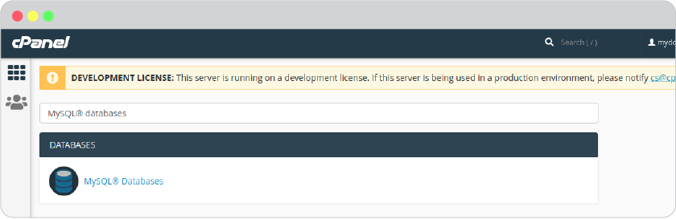

2.  In the New Database text box, enter a name for the database and click create database.

    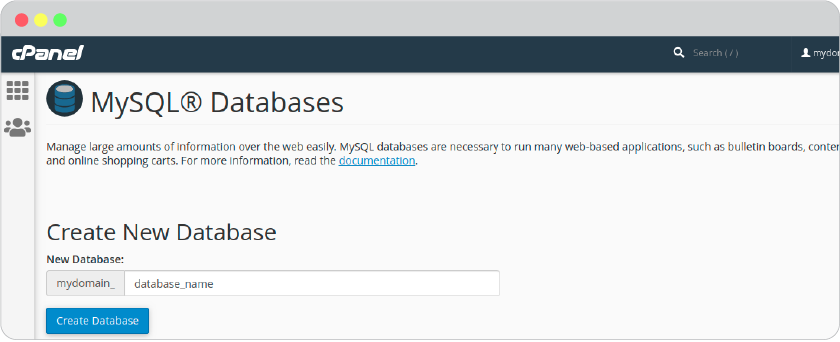

3.  A new interface will appear. Click Go Back.

    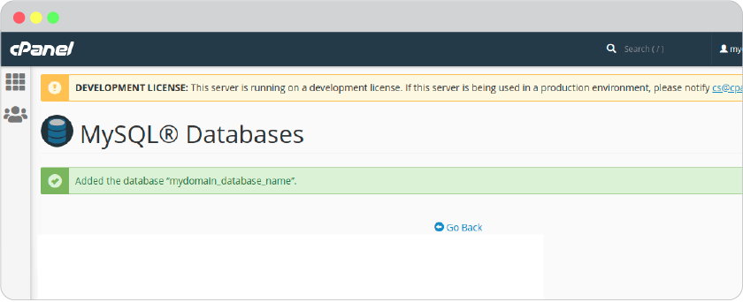

4.  The new database appears in the Current Databases table.

    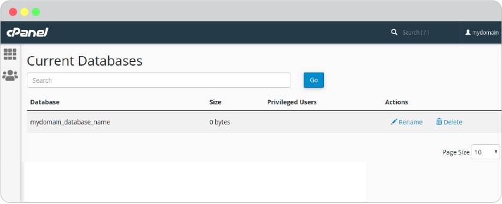

**After you created a database, add users to the database and configure their privileges. To create a new user account, perform the following steps:**

1. Enter a username in the Username text box.
2. Enter and confirm the new password in the appropriate text boxes.
3. Click Create User.

   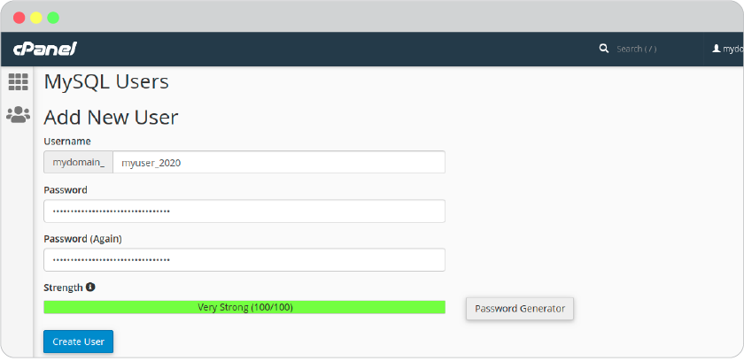

4. Click Go Back to return to the main interface.

   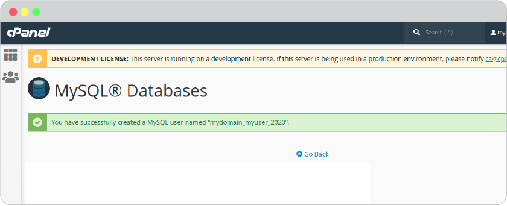

**Add a user to a database. To add a user to a database, perform the following steps:**

1. In the Add User To Database section of the interface, select the desired user and database from the menus. Click Add.

   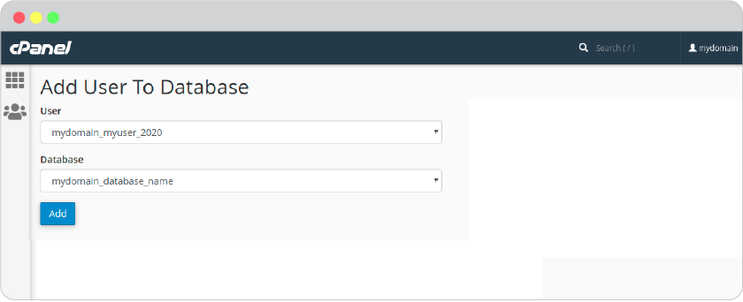

2. Select the checkboxes that correspond to the privileges that you wish to grant to the user. Click Make Changes. And click Go back to return to the main interface.

   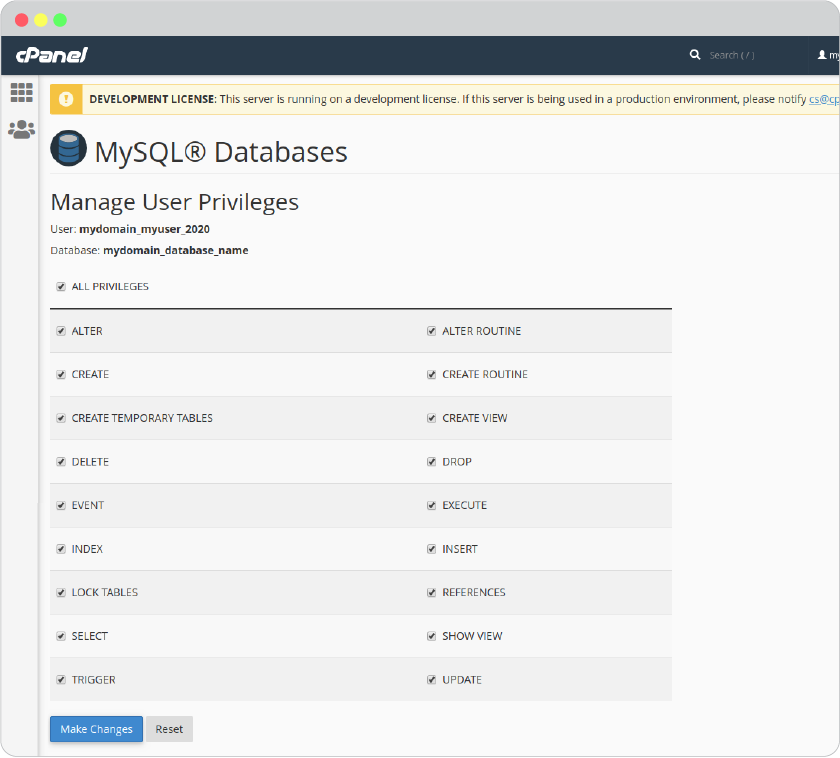

3. Download RVsitebuilder Setup wizard

   1. Download RVsitebuilder Setup wizard https://files.mirror1.rvsitebuilder.com/download/rvsitebuilderinstaller/setup to your local computer.

   2. Click botton `Upload`.

      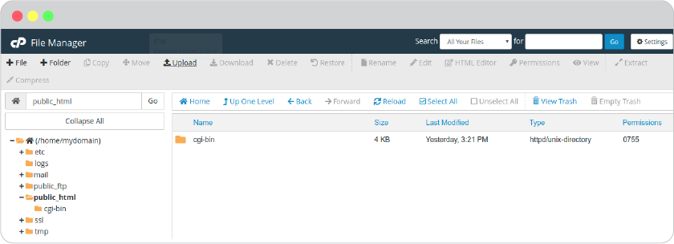

   3. A new interface will appear. Click selete and choose file download RVsitebuilder Setup wizard.

   4. Waiting a progress bar can show a complete state. 100% . And click Go back to "/home/mydomain/public_html"

      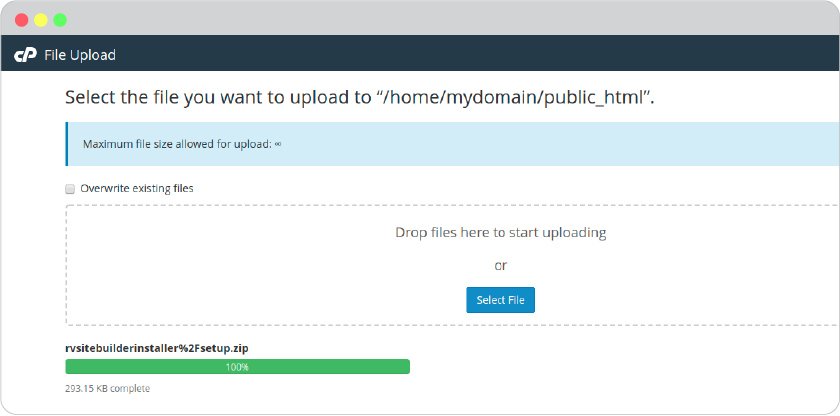

   5. Right click and choose `Extract` the setup file to "/public_html"

      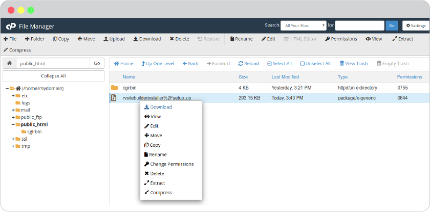
      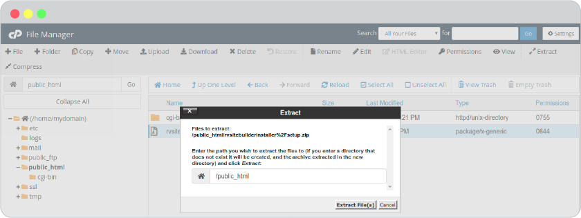

   6. completed.

      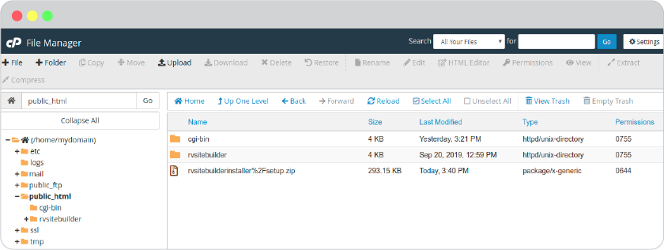

### Create Database on Direct Admin

4. Install RVsitebuilder directly on your domain name.

   1. Call the setup.php script for your domain name on browser http://mydomainname.com/rvsitebuilder/setup.php

      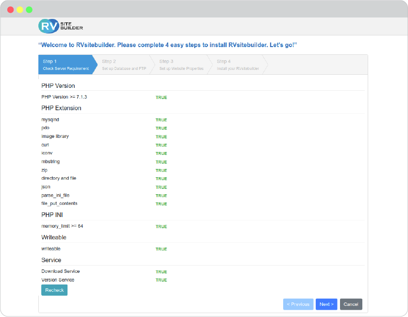

   2. Database and FTP setup

      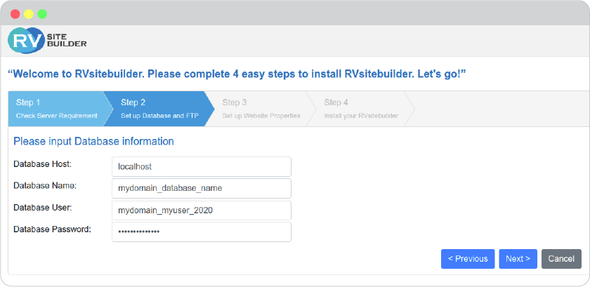

   3. website properties setup

      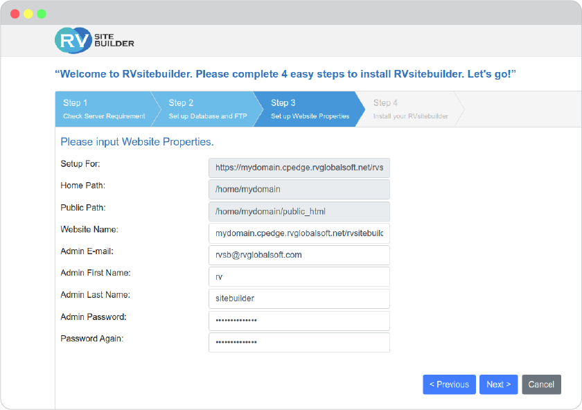

   4. Accept agreement and install.

      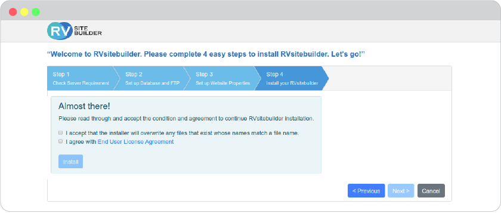
      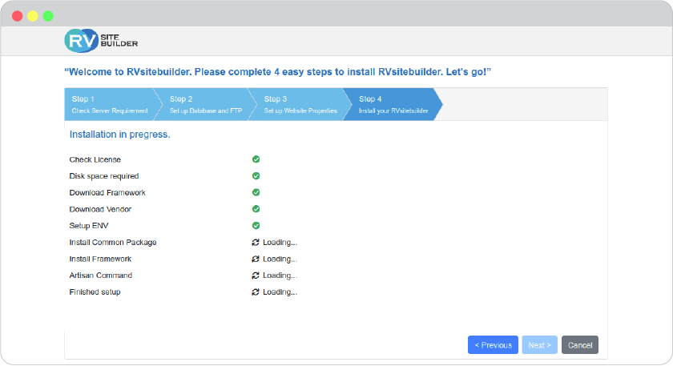

5. Once the installation is completed.
   RVsitebuilder CMS is ready to [create website]((website-design.md#create-a-new-site) on your domain now!

   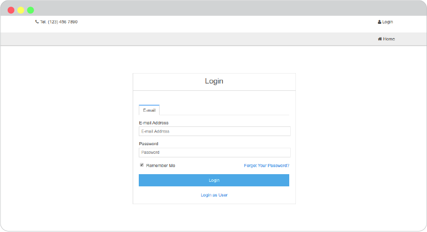

## .env configuration

Different between local and production

- Local
- Production
