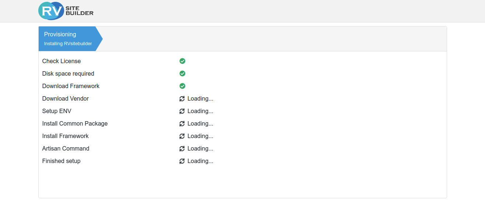
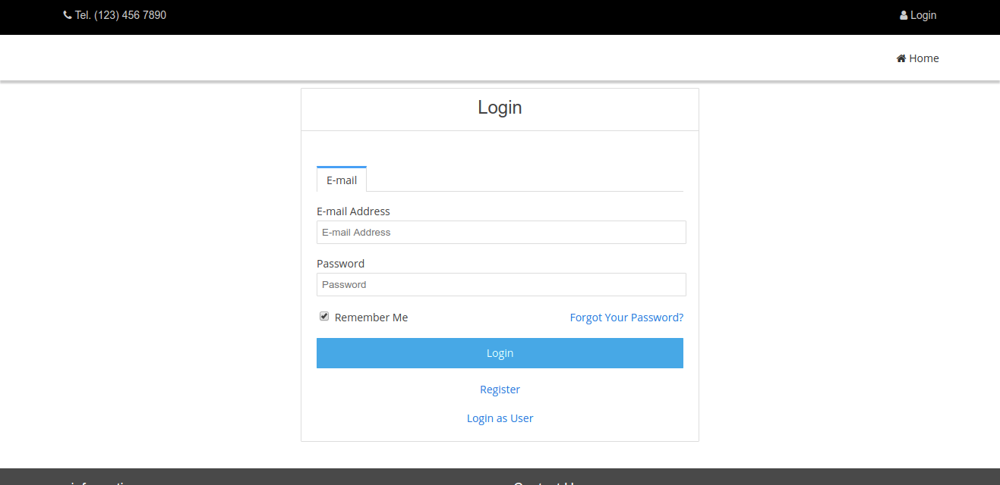

# Installation

-   [Geting a developer license](#geting-a-developer-license)
-   [Server Requirement](#server-requirement)
-   [RVsitebuilder Docker](#rvsitebuilder-docker)
-   [RVsitebuilder Wizard Install](#rvsitebuilder-wizard-install)
-   [.env configuration](#env-configuration)
-   //TODO: @amarin How to install for developer

## Geting a developer license

You can install RVsitebuilder locally on your work station for developing purpose. Please register to (https://dev.rvsitebuilder.com/) to get the developer license.

1. Register to https://dev.rvsitebuilder.com/
2. Log in to https://dev.rvsitebuilder.com/
3. Go to ‘Developer Dashboard’ https://dev.rvsitebuilder.com/devportal
   
4. Copy ’My Developer Token Auth’ It will require to install locally.

## Server Requirement

Same as Laravel, https://laravel.com/docs/master/installation#server-requirements.

## RVsitebuilder Docker

Skip this step, if you want to install on [Laravel Homestead](https://laravel.com/docs/master/homestead), [Laravel Valet](https://laravel.com/docs/master/valet), or your own web server.

If you don’t have any web server locally, follow these steps.

-   [Install for Windows 10](installation-for-windows10.md)
-   [Install for MacOS](installation-for-macos.md)

## RVsitebuilder Wizard Install

Please follow these steps:

1 Open browser http://<local_ip>:8080

2 Waiting installation.


3 System will redirect to admin page, you can login by following credential:

```
admin user: admin\@admin.com
admin pass: 1234
```



4. Enter developer token at manage app.

## .env configuration

Different between local and production

-   Local
-   Production
