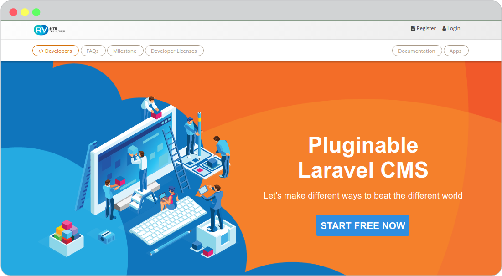

# Installation

- [Getting a developer license](#getting-a-developer-license)
- [RVsitebuilder Docker (Recommended)](#rvsitebuilder-docker-recommended)
  - [feature](#feature)
  - [docker requirement](#docker-requirement)
  - [install](#install)
  - [RUN manual ssh to container](#run-manual-ssh-to-container)
    - [ssh with www-data](#ssh-with-www-data)
    - [ssh with root](#ssh-with-root)
  - [Switch PHP multi version on container](#switch-php-multi-version-on-container)
    - [Switch to PHP 7.3](#switch-to-php-73)
  - [Switch to PHP 7.4](#switch-to-php-74)
- [Other environment](#other-environment)
  - [requirement](#requirement)
  - [install](#install-1)
- [.env configuration](#env-configuration)

## Getting a developer license

You can install RVsitebuilder locally on your work station for developing purpose. Please register to [RVsitebuilder Register](https://dev.rvsitebuilder.com/) to get the developer license.

1. Register and Login to [RVsitebuilder](https://dev.rvsitebuilder.com/)
   

2. Go to [Developer Dashboard](https://dev.rvsitebuilder.com/devportal)
   

   When you come to `Developer Dashboard` :

   **Developer Token Auth** You can copy `My Developer Token Auth` go to `Verify License your website`,It will require to install locally.

## RVsitebuilder Docker (Recommended)
   This docker already build dev tools php composer npm.
### feature
Web Service

   http://%local_ip%:80

phpMyAdmin
   http://%local_ip%:80/phpmyadmin

MailHog
   http://%local_ip%:8025

Volume Map
   document root path:
       %workspacke_path%/docker-lamp/public/
   app path:
       %workspacke_path%/docker-lamp/app/

   db access info:      
      MYSQL_USER_NAME = homestead
      MYSQL_USER_DB = homestead
      MYSQL_USER_PASS = secret

### docker requirement

docker version 19.03.8+ https://docs.docker.com/engine/install/

docker-compose version 1.25.4+ https://docs.docker.com/compose/install/

### install
1. download docker-lamp
```php
Download and Extract https://github.com/rvsitebuilder/docker-lamp/archive/master.zip to your workspace
```
2. Run docker-compose up

Optional to update docker .env file for change WEBSERVER_PORT,LOCALE,TZ

```php
cd %workspacke_path%/docker-lamp

docker-compose up -d
```

3. Open browser http://%local_ip%:80 and follow wizard installation

Step 2 Database setup

```text  
   Database name: homestead
   Database user: homestead
   Database password: secret
```

Step 3 Setup website properties
```text    
   Developer E-mail: %From Getting a developer license%
   Developer Key: %From Getting a developer license%   
```

4. After install complete you can login with 
```text 
http://%local_ip%:80/admin/login
```
### RUN manual ssh to container
#### ssh with www-data

```text
docker-compose exec --user www-data apache2php bash
```
#### ssh with root
```text
docker-compose exec apache2php bash
```
### Switch PHP multi version on container
#### Switch to PHP 7.3
```text
update-alt-php 7.3
```
### Switch to PHP 7.4
```text
update-alt-php 7.4
```

## Other environment

### requirement

Prepare web server stack
   You can choose to run docker container like [Laravel Homestead](https://laravel.com/docs/5.8/homestead), [Laravel Valet](https://laravel.com/docs/5.8/valet), or run on own web server.
 
But make sure that your domain configuration meet with the following requirements.

- Domain name must run on PHP7.1.3 or above.
- php extension: 'mysqlnd','pdo','gd','curl','iconv','mbstring','zip','posix_getpwuid','json'
- php ini config 'memory_limit' =% 64M
- mysql service already run with database
  - MYSQL_USER_NAME = homestead
  - MYSQL_USER_DB = homestead
  - MYSQL_USER_PASS = secret
- Firewall on your server doesn't block the following domains.  
  download.rvglobalsoft.com  
  Files.mirror1.rvsitebuilder.com

### install
1. Download file [https://raw.githubusercontent.com/rvsitebuilder/docker-lamp/master/public/index.php](https://raw.githubusercontent.com/rvsitebuilder/docker-lamp/master/public/index.php) and copy to web document root

2. Open browser http://%local_ip%:80 and follow wizard installation

Step 2 Database setup
```text 
   Database name: homestead
   Database user: homestead
   Database password: secret
```

Step 3 Setup website properties
```text  
   Developer E-mail: %From Getting a developer license%
   Developer Key: %From Getting a developer license%   
```

3. After install complete you can login with 

http://%local_ip%:80/admin/login

## .env configuration

Different between local and production

- Local
- Production
