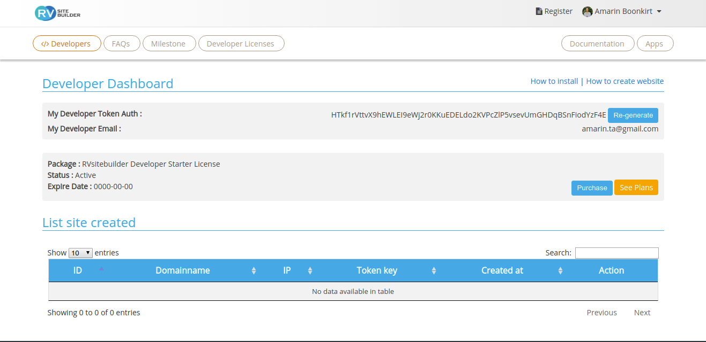

# Installation

  - [Geting a developer license](#Geting-a-developer-license)
  - [Server Requirement](#Server-Requirement )
  - [RVsitebuilder Docker](#RVsitebuilder-Docker)
  - [Installation](#Installation)
  - [.env configuration](#.env-configuration )
  
//TODO: @amarin How to install for developer

<a name="Geting-a-developer-license"></a>
## Geting a developer license



You can install RVsitebuilder locally on your work station for developing purpose. Please buy hosting service from our [hosting partners](https://rvsitebuilder.com/hosting-partner/) to get the developer license. 

1. Log in to your RVsitebuilder website as admin, click ‘App launcher’ and go to ‘Manage’ app. 
2. Go to ‘Developer Token’ on the left menu. 
3. Enter your email, accept developer agreement and click generate developer token. 
4. It will require to install locally. 


<a name="Server-Requirement"></a>
## Server Requirement 

Same as Laravel, https://laravel.com/docs/master/installation#server-requirements. 

<a name="RVsitebuilder-Docker"></a>
## RVsitebuilder Docker 

Skip this step, if you want to install on [Laravel Homestead](https://laravel.com/docs/master/homestead), [Laravel Valet](https://laravel.com/docs/master/valet), or your own web server.

If you don’t have any web server locally, follow these steps. 

1. Goto https://github.com/rvsitebuilder/docker-lamp-php72
2. Follow step to install RVsitebuilder Docker
3. After that you will got dev environment like below (local ip coule be like 192.168.x.x) : 


```php
   http://<local_ip>:8080 for document root
   http://<local_ip>:8082 for phpMyAdmin
   
   document root path:
       <workspacke_path>/docker-lamp-php72/public/
   app path:
       <workspacke_path>/docker-lamp-php72/app/
       
   db access info:
      MARIADB_HOST = mariadb
      MARIADB_DATABASE = dbname
      MARIADB_USER = dbuser
      MARIADB_PASSWORD = dbpass
``` 

<a name="Installation"></a>

- [Install for Windows 10](installation-for-windows10.md)
- [Install for MacOs](installation-for-macos.md)

Please follow these steps: 

1. Download RVsitebuilder Setup wizard https://files.mirror1.rvsitebuilder.com/download/rvsitebuilderinstaller/setup to your local computer. 
2. Unzip the setup file 
3. Upload Folder rvsitebuilder to /public_html/ or /publc/ or /www/ 
4. Call the setup.php script for your domain name on browser http://mydomainname.com/rvsitebuilder/setup.php 
5. Follow the setup steps until finish. 
6. Enter developer license at manage app.

 
<a name=".env-configuration"></a>
## .env configuration 

Different between local and production 

- Local
- Production  

 
