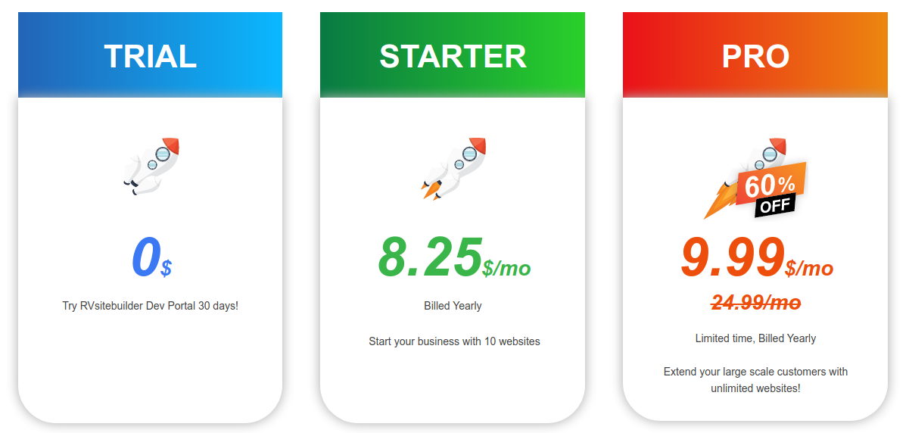

# Licenses

  <!-- - [Free Open Source License](#Free-Open-Source-License) -->

- [Free Open Source License](#free-open-source-license)
- [Hosting Provider License](#hosting-provider-license)
- [Developer License](#developer-license)
  - [Get Free 30-day Trial Developer Starter License](#get-free-30-day-trial-developer-starter-license)
  - [Developer Pro License](#developer-pro-license)
  - [License Comparison](#license-comparison)

<!-- TODO: @sirishom revise ใหม่อีกนะครับ ตัว open source comment ไว้ก่อน-->

> {info} Installing public or private RVsitebuilder App requires either Hosting Provider or Developer License. Get Free Developer Starter License if you do not have one.

<!--
## Free Open Source License
Suitable for end-user looking for a free CMS with drag and drop editor. It comes with free basic templates. But cannot install public or private RVsitebuilder's app to extend its functionalities. -->

## Hosting Provider License
Our [hosting partners](https://rvsitebuilder.com/hosting-partner/) are around the world. They provide RVsitebuilder as a value added service. Any web site run on these servers will get full feature, no other license require. 

## Developer License

### Get Free 30-day Trial Developer Starter License 

If you want to host your own, you can get a free 30-day trial developer starter license. No credit card required. You can use RVsitebuilder to build any web site free for 10 websites. License is a 30-day free trial that you can renew it for 1 year. After the 30-day trial ends without renewing, the created websites and existing Apps will works as normal BUT will not be able to install and update App either private or public Apps. Check [comparison](https://dev.rvsitebuilder.com/developer-licenses) for more detail. 

[Get Free 30-day Trial Developer Starter License here.](https://dev.rvsitebuilder.com)

### Developer Pro License

Only $299 / year,$119.88 / year. Unlimited web sites. 

### License Comparison

<!-- TODO: @sirishom link มียัง -->
Go to our website to find [license comparison](https://dev.rvsitebuilder.com/developer-licenses) in detail. at [Get free developer starter license here.](https://dev.rvsitebuilder.com)

