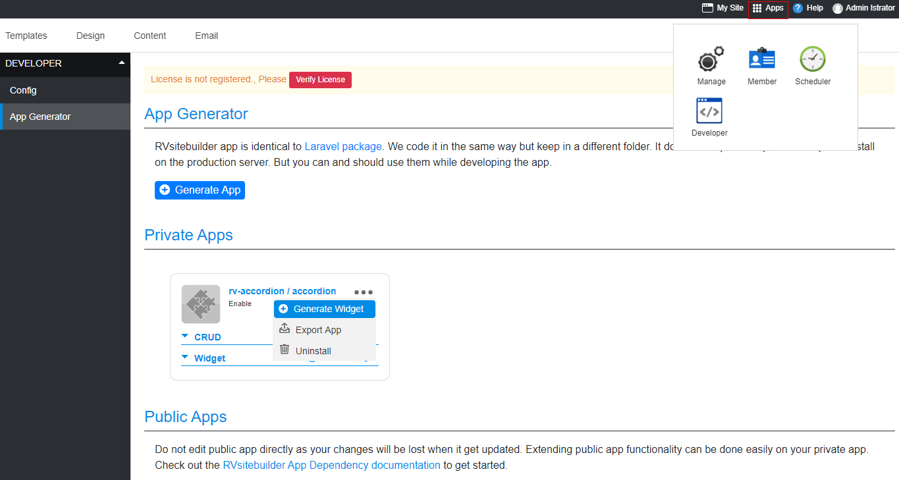

# RVsitebuilder Widget

- [Widget](#widget)
- [Create new widget](#create-new-widget)
- [How it works](#how-it-works)
- [Widget config](#widget-config)
- [Widget Blade and Design](#widget-blade-and-design)
- [View composer](#view-composer)
- [Widget Standard Config Panel](#widget-standard-config-panel)
- [Config Panel Elements](#config-panel-elements)
- [Widget Section Template](#widget-section-template)
  <!-- - [Config Panel Elements](#Config-Panel-Elements) -->
- [Widget Section Template](#Widget-Section-Template)

<a name="Widget"></a>

## Widget

Widget is a RVsitebuilder special element that make your `editable system page` more dynamic and configurable.

```php
/packages/vendor-name/project-name/
                    ├── resources
                    │    ├── js
                    │    │  └── admin
                    │    │      └── widget.js
                    │    └── views
                    │       ├── sections
                    │       │   ├── allsections.blade.php
                    │       │   ├── sectionicon.blade.php
                    │       │   ├── widgetName
                    │       │   │   └── 1-section.blade.php
                    │       └── widgets
                    │           ├── alltoolbars.blade.php
                    │           ├── widgetName
                    │           │   ├── designs
                    │           │   │   └── design1.blade.php
                    │           │   ├── panel.blade.php
                    │           │   └── widget.blade.php
                    ├── src
                    │   └── Http
                    │       ├── Composers
                    │       │   └── Widget_ViewComposer.php
```

<a name="Create-new-widget"></a>

## Create new widget

<a name="How-it-works"></a>
ขั้นตอนนี้สามารถทำได้หลังจากมีการติดตั้ง Developer App เรียบร้อยแล้ว (<a href="creating-new-app"> Creating New App</a>)

1. บน Topbar คลิกเมนู Apps เลือก ไอคอน Developer
2. ในหน้า Developer คลิกปุ่ม Generate App
3. ระบุ vendor-name และ project-name
4. คลิกปุ่ม create
5. ในหน้า Developer ส่วน Private Apps จะแสดง Apps ใหม่ที่สร้างขึ้นมา
6. คลิกปุ่ม treedots คลิก Generate Widget
7. ระบุชื่อ Widget Name โดยสามารถสร้างได้ไม่จำกัดจำนวน

   

8. จะได้โครงสร้าง widget ดังนี้

   ```php
   /packages/vendor-name/project-name/
                    ├── resources
                    │    └── views
                    │       ├── sections
                    │       └── widgets
                    │           ├── alltoolbars.blade.php
                    │           ├── widgetName-first
                    │           │   ├── designs
                    │           │   │   └── design1.blade.php
                    │           │   ├── panel.blade.php
                    │           │   └── widget.blade.php
                    |           ├── widgetName-second
                    │           │   ├── designs
                    │           │   │   └── design1.blade.php
                    │           │   ├── panel.blade.php
                    │           │   └── widget.blade.php
   ```

ปล. การนำไปใช้งานใน wysiwyg ไปที่เมนู Content >> Section >> Your Widget Name

## How it works

`renderWidget middleware`

<a name="Widget-config"></a>

## Widget config

-How-To-Register-Widget-config.md

Config ส่วนนี้จะมี title และ design เป็นค่าเริ่มต้นที่ใช้ใน Panel Toolbar ส่วนชื่ออื่นๆขึ้นอยู่กับการกำหนด Setting ต่างๆ ของ Widget

ไฟล์ config >> widget.php

```php
/packages/vendor-name/project-name/
                ├── config
                │    └── widget.php
```

```php

<?php

return [
    'widgetName' => [
        'blade' => 'widgets.widgetName.widget',
        'frame-style' => 'width:250px;height:460px;',
        'setting' => [
            'title' => 'Example Widget',
            'design' => 1,
            'showdate' => 1,
            'showhours' => 1,
            'showminutes' => 1,
            'showseconds' => 1,
            'icon' => 'uk-icon-clock-o',
            'format' => '12',
        ],
    ],

];

```

### Global widget

Widget that shows the same content on every page.

<a name="Widget-Blade-and-Design"></a>

## Widget Blade and Design

Widget blade contains your `app's widget design` according to the user config.

ในส่วน Widget ที่มีหลายๆ Design นอกจากจะกำหนดค่า config แล้ว ยังต้องเพิ่มโค้ดที่สอดคล้องหรือเชื่อมโยงกันดังนี้

```php
── widgets
    |── alltoolbars.blade.php
    ├── widgetName
    │   ├── designs
    │   │   └── design1.blade.php
    |   |   └── design2.blade.php
    │   ├── panel.blade.php
    │   └── widget.blade.php


```
1. ไฟล์ alltoolbars.blade.php เป็นไฟล์ที่โปรแกรม Generate เพื่อใช้บน Insert Toolbar
   
```php
@inject('appJson', 'Rvsitebuilder\Manage\Lib\ConfigLib')	
<li data-insertwidget>
    <a href="javascript:void(0)">
        <span class="icon-padd wys-insert-tool wys-hyperlink-icon"></span> 
        <span> 
            @if(isset($appJson->getAppConfig()['vendor-name/project-name']['alias']))  
            {{ $appJson->getAppConfig()['vendor-name/project-name']['alias'] }}
        @else
            project-name
        @endif 
        </span> 
        <span class="uk-icon-caret-right pull-right"></span>
    </a>
    <ul class="ddListLink rv-bgwidget">
        <li>
            <a data-panel='.widgetName' data-widget = 'vendor-name/project-name' data-widgetname='widgetName'><i class='icon-padd wys-insert-tool wys-table-icon'></i>WidgetName</a>
        </li>
        <!--WIDGET_GENERATOR-->
    </ul>
</li>

```

2. ไฟล์ design1.blade.php, design2.blade.php คือการสร้างไฟล์ดีไซต์ใหม่ๆ ตามจำนวนที่ต้องการ
   หากมี Java Script, php, Html, CSS ที่มีความแตกต่างเฉพาะดีไซต์ สามารถวางโค้ดในไฟล์นั้นๆได้

```php
<div class="widgetName-design1">
    <div class="uk-width-1-1 uk-text-left">
        <div class="uk-background-primary">
            <h3 class="uk-h3"> {{$setting['title']}}</h3>
        </div>
    </div>
    <div class="uk-panel">
        Code Design
    </div>
</div>

```

3. ไฟล์ widget.blade.php คือ การเรียกใช้ไฟล์ดีไซต์แบบต่างๆ ตามจำนวนไฟล์ที่สร้างขึ้น จากโฟล์เดอร์ designs

```php
<div class="containerWidget">
    @includeWhen($setting['design'] == 1, 'vendor-name/project-name::widgets.widgetName.designs.design1')
    @includeWhen($setting['design'] == 2, 'vendor-name/project-name::widgets.widgetName.designs.design2')
</div>
```

4. ไฟล์ panel.blade.php คือโครงสร้าง Panel Toolbar ที่แสดง Setting Tab และ Design Tab โดยมีรูปแบบดังนี้

    4.1 การตั้งค่า Widget Name และ Widget Title

    ```php

    @extends('rvsitebuilder/wysiwyg::admin.layouts.master_widget',
    [
    'appName' => $appName,
    'widgetName' => $widgetName,
    'setting' => $setting
    ])

    @section('widget-title')
    Example Widget
    @overwrite
    ```

   4.2 โค้ดการตั้งค่าต่างๆ เพื่อแสดงใน Setting Tab

   ```php

   @section('widget-setting')

   <div class="title">
        <span>Title</span>
        <input type="text" class="wbInputbox" cmd="setting_title" />
    </div>
    <div class="clear"></div>

   @overwrite
   ```

   4.3 โค้ดการเรียกใช้พาธรูป Thumbanil ของแต่ละดีไซต์ เพื่อแสดงใน Design Tab

   ```php
   @section('widget-design')

      <div class="uk-margin-small-bottom">Select design</div>
      <div class="rv-thumb-active toolbar-panel-scrollbar">
          <div>
              <label for="widgetName-radio-1">
                  <input type="radio" name="radio" class="widgetName_setting_design wbRadiobox" cmd="setting_design" value="1" id="widgetName-radio-1" style="display:none;">
                  
              </label>
          </div>
          <div>
              <label for="widgetName-radio-2">
                  <input type="radio" name="radio" class="widgetName_setting_design wbRadiobox" cmd="setting_design" value="2" id="widgetName-radio-2" style="display:none;">
                  
              </label>
          </div>
      </div>

   @overwrite
   ```

<!-- > {info} End-users may edit raw blade file directly on RVsitebuilder WYSIWYG to suit their needs. -->

<a name="View-composer"></a>

## View composer

RVsitebuilder use view composer extensively. Especially using together with middleware to build the widget dynamically.

<a name="Widget-Standard-Config-Panel"></a>

## Widget Standard Config Panel

<!--
<a name="Config-Panel-Elements"></a>
TODO: @Jatuporn help me please.

## Config Panel Elements
### color picker
### slider -->

<a name="Widget-Section-Template"></a>

## Widget Section Template

แสดงการใช้งานในเมนู Content >> Section >> Widget Name
มีโครงสร้างดังนี้

```php
/packages/vendor-name/project-name/
                ├── resources
                │    └── views
                │       └── sections
                │           ├── allsections.blade.php
                |           |── sectionicon.blade.php
                │           ├── widgetName
                │           │   ├── 1-section.blade.php


```
1. โครงสร้างไฟล์ allsections.blade.php แสดงการเรียกใช้ไฟล์ widget
   
```php
<div class="section-category rv-widget-project-name" style="display: none; margin-top: -12px;">
    <div id="widget-project-name" class="widgetSection widget-project-name" style="margin:0 auto;">
        <div id="widget-project-name" class="widgetform">
            @include('vendor-name/project-name::sections.widgetName-first.1-section')
            @include('vendor-name/project-name::sections.widgetName-second.1-section')
        </div>
    </div>
</div>
``` 
2. โครงสร้างไฟล์ sectionicon.blade.php แสดงการเรียกใช้ไอคอน โดยแก้ไขให้สอดคล้องกับ widget นั้นๆได้
   
```php
@inject('appJson', 'Rvsitebuilder\Manage\Lib\ConfigLib')

<div onclick="content_class('rv-widget-project-name');" class="section-name active-section-name">
    <span class="uk-icon uk-icon-home rv-icon-size"></span>

    @if(isset($appJson->getAppConfig()['vendor-name/project-name']['alias'] ) )
        {{ $appJson->getAppConfig()['vendor-name/project-name']['alias'] }}
    @else
        project-name 
    @endif
</div>
``` 
3. โครงสร้างไฟล์ 1-section.blade.php แสดงการเรียกใช้พาธรูป Thumbanil โดยสามารถเปลี่ยนแปลงแก้ไข ตำแหน่ง,ชื่อรูป ให้สอดคล้องกับ widget นั้นๆได้

```php
<icon-widget>
    <div class="blockWidget" title="widgetName" widget="vendor-name/project-name"
        widgetname="widgetName">
        <div>
            <div class="view"></div>
            
        </div>
    </div>
</icon-widget>
<design>
    @include('rvsitebuilder/core::layouts.widget_wys_master_header')
    
    @include('rvsitebuilder/core::layouts.widget_wys_master_footer')
</design>

    ```

```

```

```

```

```

```

```

```

```

```
