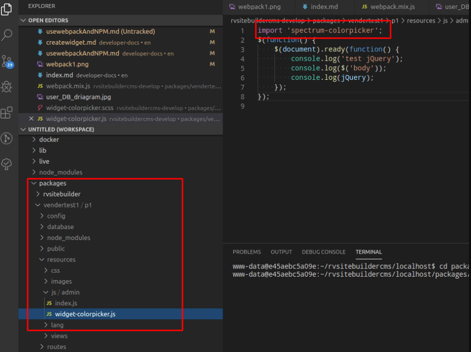
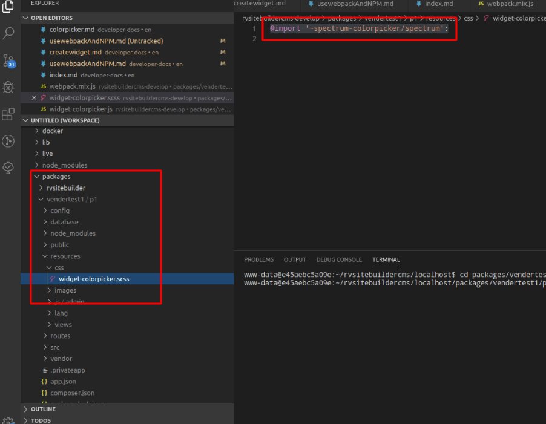
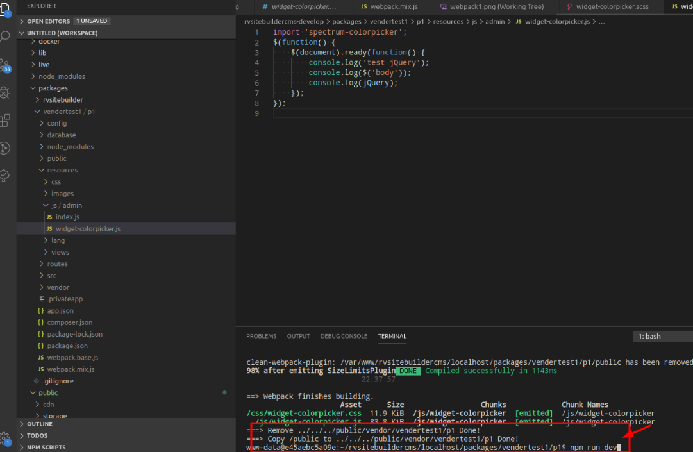

# Webpack

แนะนำให้ดู create widget ก่อน [Create Widget](createwidget.md)
ขั้นตอนการใส่ javascript ใช้งานร่วมกับ webpack โดยจะอธิบายการเรียกใช้ "colorpicker" จาก node_module ให้ใช้งานร่วมกับ widget ได้อย่างไรดังนี้
ต้องติดตั้ง node_module ก่อนที่ packages/vendertest1/p1

```php
cd /localhost/packages/vendertest1/p1
npm run install
```

ให้เปิดไฟล์ packages/vendertest1/pi/webpack.mix.js
ใส่ code ดังนี

```php
mix.js(
    'resources/js/admin/widget-colorpicker.js',
    'js/widget-colorpicker.js.js'
);
mix.sass(
    'resources/css/widget-colorpicker.scss',
    'public/css/widget-colorpicker.css'
);

```

แนะนำให้ดู [laravel mix](https://laravel.com/docs/7.x/mix)
<br>

เปิดไฟล์ 'packages/vendertest1/p1/resources/js/admin/widget-colorpicker.js'
ให้ใส่ code

```php
import 'spectrum-colorpicker';
```



เปิดไฟล์ 'packages/vendertest1/p1/resources/css/widget-colorpicker.scss'
ให้ใส่ code

```css
@import '~spectrum-colorpicker/spectrum';
```


หลังจากนั้นให้ npm run dev เพื่อให้ webpack สร้างไฟล์ขึ้นมา แนะนำให้ดูข้อมูล [laravel mix](https://laravel.com/docs/6.x/mix)
```php
จากตัวอย่าง
cd /localhost/packages/vendertest1/p1
npm run dev
```

*** ถ้าเราเขียน script หรือ เปลี่ยนแปลงในไฟล์ นี้
packages/vendertest1/p1/resources/js/admin/widget-colorpicker.js
packages/vendertest1/p1/resources/css/widget-colorpicker.scss
จำเป็นต้อง npm run dev
