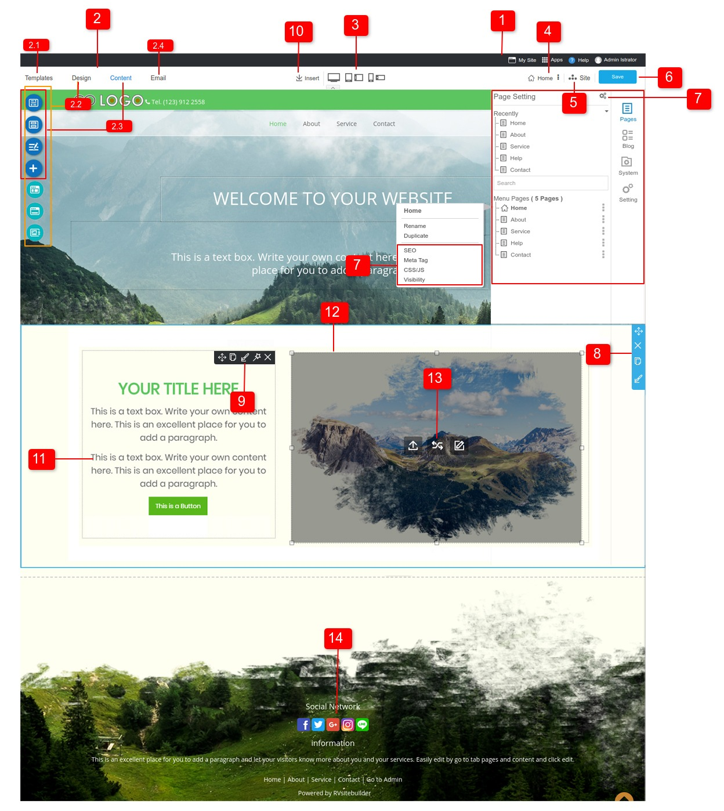
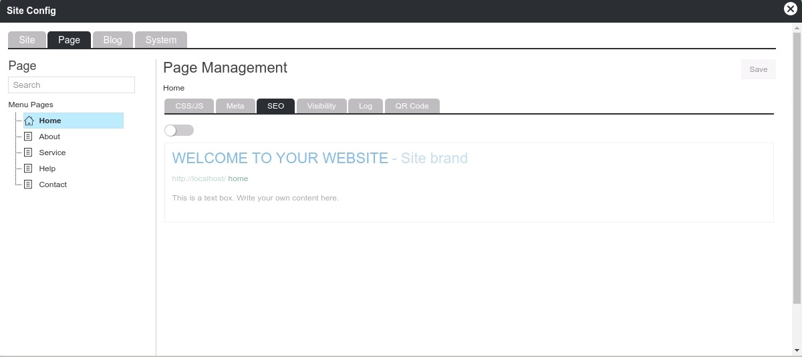

# RVsitebuilder developer documentation

- [WYSIWYG Overview](#wysiwyg-overview)

## WYSIWYG Overview

WYSIWYG Editor เป็นส่วนที่ใช้ในการปรับแต่งเว็บไซต์ โดยมีเครื่องมือที่ง่าย วิธีใช้งานเพียงคลิกที่ Element, Block, Section หรือเมนูอื่นใด ก็จะแสดง Panel Toolbar ที่ช่วยให้คุณสร้างเว็บไซต์ที่สวยงามและปรับแต่งเองได้อย่างรวดเร็ว ตลอดจนการเพิ่มหน้าเพจ,โพส,หมวดหมู่ต่างๆ,รูปภาพ,สื่อโซเชียล,แบบฟอร์ม,widget และเพิ่มเติมเนื้อหาใดๆที่คุณต้องการได้อย่างง่ายดาย อีกทั้งโปรแกรมยังสามารถรองรับ Apps, Widget และ widget Design รูปแบบใหม่ๆ ที่พัฒนาจาก Develpoer ได้อีกด้วย

1.  Topbar

    คือแถบเมนูหลักที่แสดงสถานะการอัพเดทเวอร์ชั่นของโปรแกรมและแสดงเมนูที่เข้าถึงส่วนต่างๆของโปรแกรมได้ 

    - ปุ่ม My Site ใช้สำหรับ Publish Website
    - ปุ่ม Help คู่มือการใช้งานโปรแกรม
    - ปุ๋ม Apps แสดงจำนวน Apps เริ่มต้นที่โปรแกรมมีให้ รวมถึง Apps ที่ผู้ใช้ติดตั้งเข้ามาผ่านเว็บไซต์ apps.rvsitebuilder.com และ Private Apps ที่สร้างโดย Apps Generator
    - แสดงข้อมูล User/Admin Profile

2.  Main Menu

    คือแถบเมนูหลักของโปรแกรมที่แสดงในทุกๆหน้า โดยแต่ละเมนูมีหลักการทำงานดังนี้

    2.1 Templates

    คือเมนูที่สามารถกลับไปเปลี่ยน Template ใหม่ได้ โดยจะเปลี่ยนแปลงดีไซต์เฉพาะส่วน header และ footer เท่านั้น ซึ่งเนื้อหาข้อมูลจะยังคงอยู่ เช่น โลโก้, เบอร์โทร, ที่อยู่บน footer รวมถึงข้อมูลภายในเว็บไซต์แต่ละหน้าด้วย

    2.2 Design

    คือกลุ่มไอคอนเมนูที่แยกตามส่วนประกอบของแท็มเพลตเว็บไซต์ ประกอบด้วยเมนู Website, Top Menu, Menu, Banner, Sidebar, Footer, Sort Header เมื่อคลิกเลือกไอคอนเมนูจะแสดงเครื่องมือ Panel Toolbar ใช้ในการเปลี่ยนแปลงดีไซต์ รูปแบบเลเอาท์ การซ่อน/แสดงและการตั้งค่าต่างๆของเว็บไซต์ ที่แสดงให้เห็นผลลัพธ์การเปลี่ยนแปลงบนหน้าเว็บไซต์แบบทันทีทันใดและสามารถเลือกใช้ได้โดยการกดปุ่ม Save

    2.3 Content

    คือกลุ่มไอคอนเมนูที่ใช้ในเพิ่ม/เปลี่ยนแปลงข้อมูล ของเว็บไซต์ ประกอบด้วยเมนูดังนี้

    - Section เป็นกลุ่มเมนูที่จัดตามหมวดหมู่ของข้อมูลและวิดเจ็ต(Social,blog) โดยแต่ละหมวดหมู่มีให้เลือกใช้หลากหลายรูปแบบ วิธีใช้งานโดยลากแล้ววาง (Drag and Drop) ลงในส่วน Body Template นอกจากนี้ยังเป็นส่วนแสดงผลของ Widget Icon และ Widget Design ที่สร้างขึ้นจาก Apps Generator ด้วย
    - Form มีเลเอาท์ดีไซต์ให้เลือกหลายรูปแบบ วิธีใช้งานโดยลากแล้ววาง (Drag and Drop) ลงในส่วน Body Template โดยมีเครื่องมือ Form Design Panel และ Email Setup Panel สำหรับการปรับแต่งดีไซต์และตั้งค่าการจัดการอีเมลล์ หากมีการใช้งาน Form Design ยังสามารถเพิ่ม form fields แบบต่างๆให้เหมาะสมกับความต้องการได้
    - Menu, Top Menu คือเป็นส่วนการเพิ่มชื่อเมนูของเว็บไซต์, Icon, Badge และการตั้งค่าลิ้งปลายทางของเมนูนั้นๆ โดยมี Panel Toolbar สำหรับตั้งค่าการจัดการต่างๆได้
    - New Page, New Post คือเมนูสำหรับเพิ่มจำนวน Page, Post, Category ซึ่งในหน้าต่างการเพิ่ม Post นั้นสามารถเพิ่ม Category หรือ Sub Category ใหม่ๆได้

    2.4 Email

    คือ เมนูแสดงระบบ Email Template

3.  View Mode

    กลุ่มของปุ่มที่ใช้ดูตัวอย่างการแสดงผลของเว็บไซต์บนหน้าจอที่มีขนาดแตกต่างกัน

4.  Page Status and 3-Dot Option

    แสดงสถานะของชื่อหน้าเว็บไซต์ที่กำลังใช้งานอยู่และมีตัวเลืิอกปุ่ม 3-Dot แสดงส่วนการจัดการ Option ต่างๆ เช่น Set as home, Rename, Hide, Duplicate, SEO, Visibility, Page Management หรือเรียกไปยัง Site Config ที่ใช้ในการเปลี่ยนแปลงเพื่อให้เข้าถึงได้อย่างรวดเร็ว

5.  Site (page/post/system page)

    แสดงจำนวนของ Page, Post, Blog Category, System Page และในแต่ละหน้ามีตัวเลืิอกปุ่ม 3-Dot แสดงส่วนการจัดการ Option ต่างๆ

6.  Save Button

    ปุ่มบันทึกเมื่อมีการเพิ่มเติม/เปลี่ยนแปลงข้อมุล หรือปรับแต่งดีไซต์เสร็จสิ้นแล้ว

7.  Site Config

    การตั้งค่าเกี่ยวกับ SEO, Base URL, เพิ่ม CSS/JS, Visibility และอื่นๆของทั้งเว็บไซต์ (Site Tab) โดยส่วนการจัดการแยกเป็นแท็บ Page, Post, Blog, System และเลือกปรับเฉพาะหน้าเว็บเพจได้ ซึ่งสามารถเข้าถึงได้หลายทางขึ้นอยู่กับว่าเราใช้งานอยู่ในส่วน Apps หรือ WYSIWYG

    

8.  Section

    เมื่อคลิกที่ Section ใดๆภายในเว็บไซต์จะแสดงเส้นกรอบสีฟ้าและกลุ่มเมนูไอคอนที่ใช้ในการควบคุมการทำงานของ Section นั้น ประกอบด้วยไอคอน Move, Delete, Duplicate, Edit โดยไอคอน Edit นั้นแสดงเครื่องมือ Section Properties ที่ใช้ในการปรับแต่งดีไซต์ได้

    ตัวอย่างประเภทของ Section เช่น: Topmenu Section, Content Section, Widget Section (Social, Blog, Google Map), Footer Section

9.  Block

    เมื่อคลิกที่ Block layout ใดๆภายใน Body Template จะแสดงเส้นประสีดำและกลุ่มไอคอนเมนูที่ใช้ในการควบคุมการทำงานของ Block นั้น ประกอบด้วยไอคอน Move, Delete, Duplicate, Edit โดยไอคอน Edit นั้นแสดงเครื่องมือ Block Properties ที่ใช้ในการปรับแต่งดีไซต์ได้

10. Insert Toolbar

คือส่วนแสดงกลุ่มเมนู Widget, Link, Button, Image, Youtube, Icon, Speacial Charactor, Sebparate Line ที่ใช้ในการแทรกข้อมูลใดๆ ในตำแหน่งที่ได้คลิกภายใน Block แต่การใช้งานของ Widget จะมีความแตกจากเมนูอื่นเนื่องจากสามารถแทรกตำแหน่งค้านล่างของ Section และแทรกด้านขวาของ ฺBlockได้ ทั้งนี้เมนู Widget นั้นยังเป็นส่วนแสดงผลของ Widget ใหม่ๆที่สร้างขึ้นจาก Apps Generator ด้วย

11. Text Toolbar Panel

    เมื่อคลิกในข้อมูล Heading, Paragraph, Table ที่อยู่ภายใน Blcok ของเว็บไซต์ จะแสดงเครื่องมือ Text Toolbar เพื่อใช้ในการปรับแต่งดีไซต์

12. Image Toolbar Panel

    เมื่อคลิกรูปภาพภายใน Block จะแสดง Image Toolbar เพื่อใช้ในการปรับแต่งดีไซต์

13. Image Manager

    เป็นเครื่องมือการจัดการภาพ มี Free Image, Free Background หรือภาพที่มีการเรียกใช้ผ่านโซเชียลต่างๆ ตลอดจนการอัพโหลดและการจัดการภาพและโฟล์เดอร์ด้วย
    เครื่องมือนี้เรียกใช้ได้หลายทางขึ้นอยู่กับการใช้งาน

    - มาจากเมนู Insert Tool >> Image
    - ไอคอน Replace เมื่อคลิกที่รูปภาพที่ใช้ภายใน block
    - ไอคอน Edit Block และ ไอคอน Edit Section

14. Widget Setting Panel

    เมื่อมีการใช้งาน Widget ภายในเว็บไซต์ สามารถแก้ไขการตั้งค่าต่างๆได้โดยการคลิกที่ Widget Section นั้น จะแสดง Widget Panel Setting สำหรับการจัดการ Widget ซึ่งในส่วนนี้เอง Developer สามารถสร้าง Config Setting และ Design Setting เข้ามาใช้ในโปแกรมได้

    ตัวอย่าง Widget ในโปรแกรมที่มีลักษณะโครงสร้างไฟล์และการใช้งาน Panel Setting ที่เหมือนกัน

    - Social
    - Blog
    - Widget ที่สร้างขึ้นจาก Apps Generator
    - System Pages (Forget Password, Account, Password Expired, Login, Register, Admin Login)

 
 ดูการใช้งานอย่างละเอียดได้ที่ https://user.rvsitebuilder.com/docs/7.3/en/admin-interface
